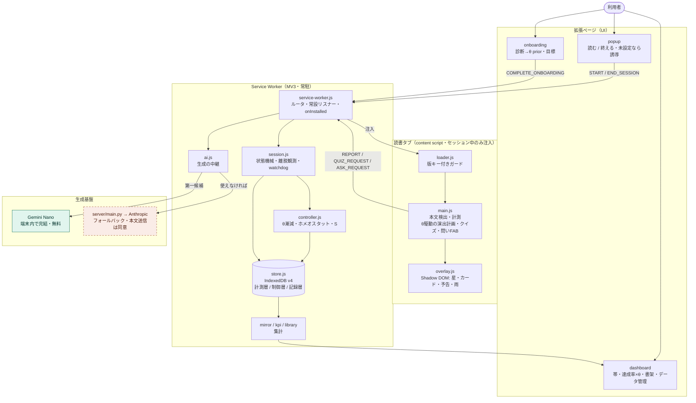
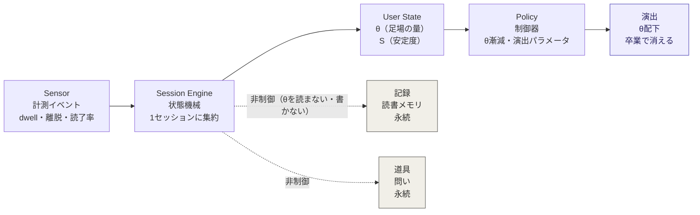
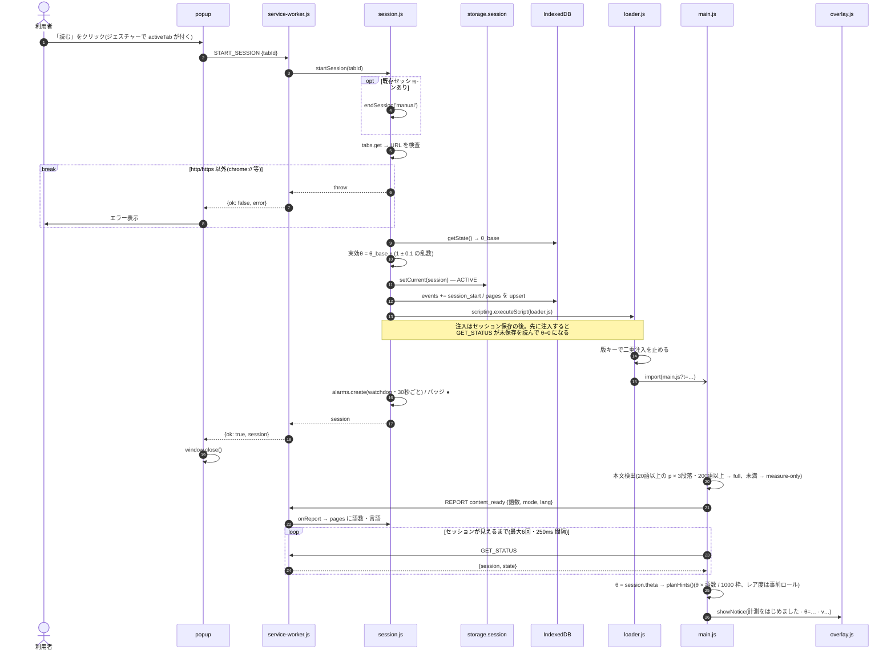
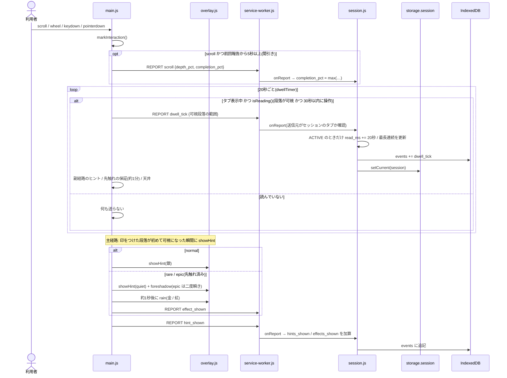
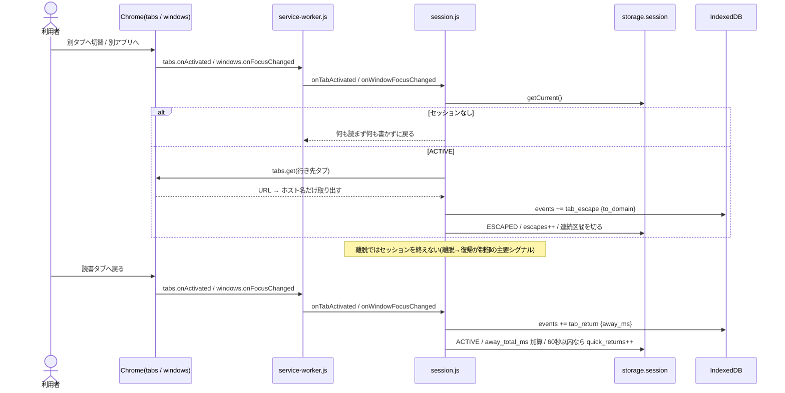
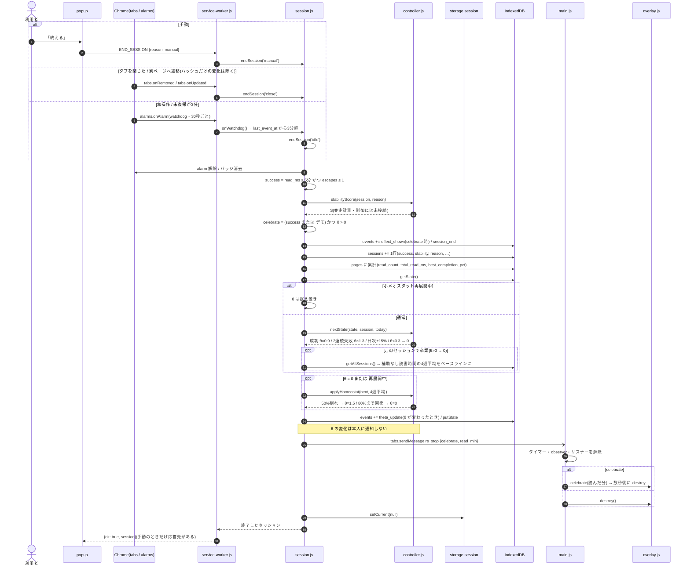
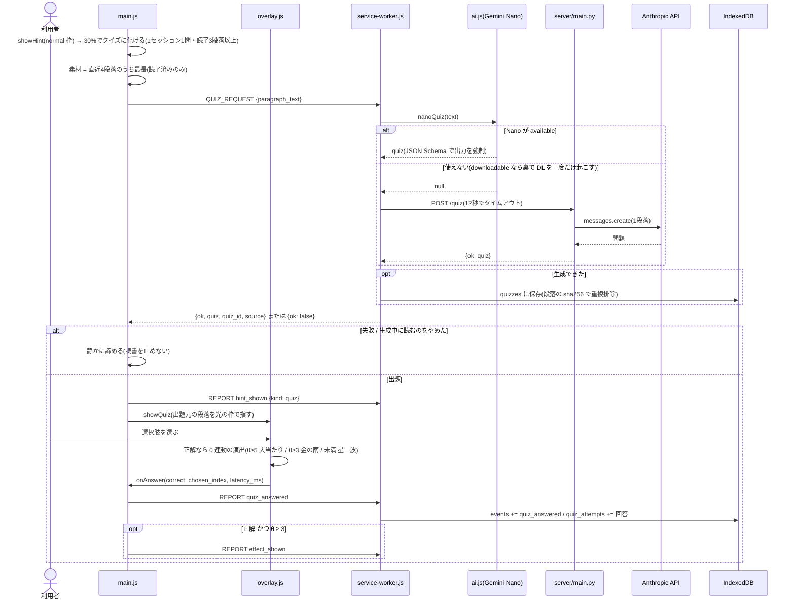
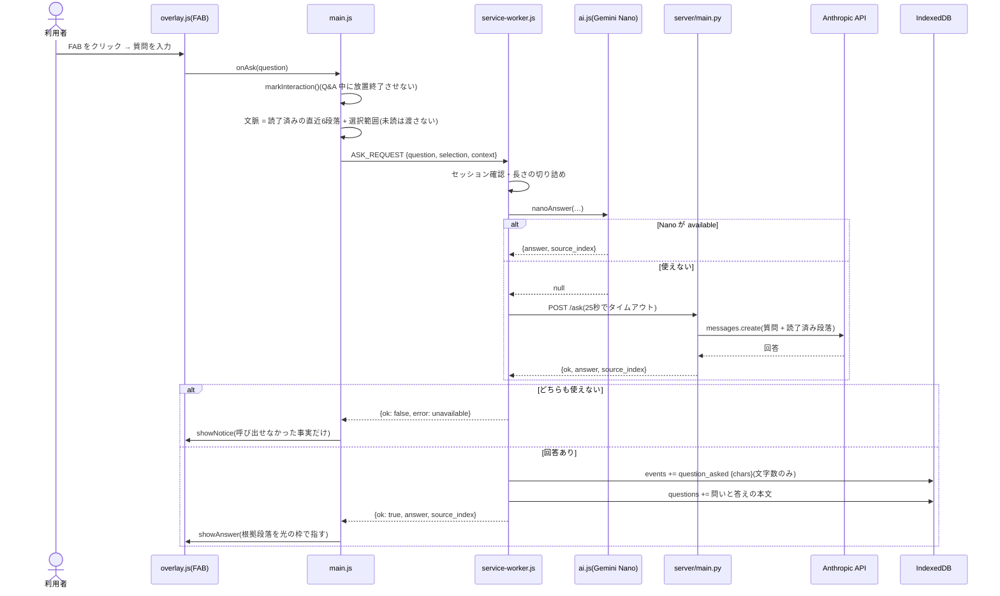
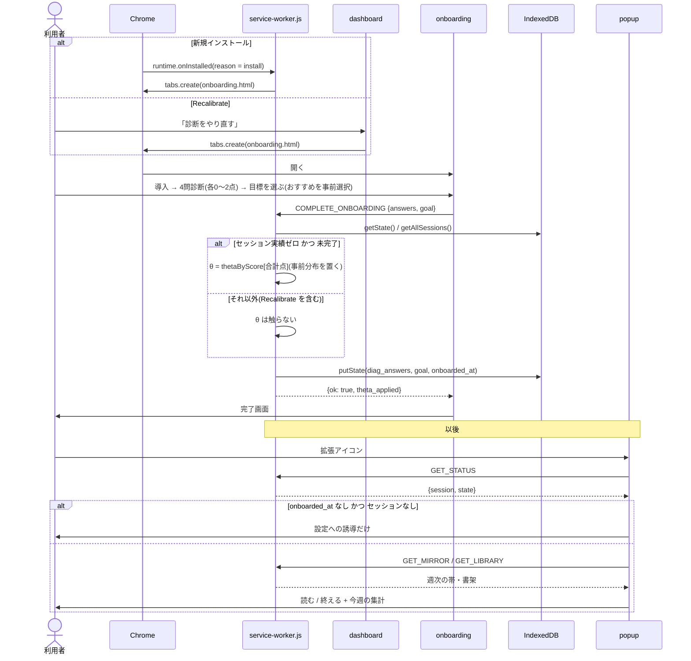
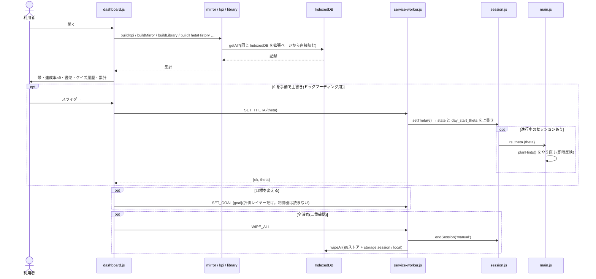

# Architecture v1: reading-scaffold

- **Status:** 唯一のsource of truth(2026-09-14)。旧 `design-doc-v0.md` は `docs/archive/` に移し、本書が置き換える
- **対応コード:** v0.13.0 時点の実装に一致させて書いている。「計画」と明記した項以外は現物
- **Audience:** 実装者(本人+AI)。製品の Why は PRD v2(リポジトリ外)に委ね、本書は What/How
- **関連:** [reward-design.md](reward-design.md)(演出の設計判断) / [data-design.md](data-design.md)(データ3層) / [ask-and-nano-design.md](ask-and-nano-design.md)(問いと生成基盤) / [research/](research/)(文献)

---

## 0. 一段落で言うと

reading-scaffold は、**読書の継続に必要な外部の足場(刺激・注意の支え)を推定し、読む力を保ったまま、その足場を本人が気づかない速度で取り除いていく**Chrome拡張である。「ドーパミン」はユーザー向けのメタファーであって、システム変数ではない(脳内ドーパミンは測っていない)。システムが実際に制御するのは**足場の量 θ ただ一つ**で、その目標値は常に 0 である。

足場が消えた後に残るものが二つある。**記録**(読書メモリ=本人の資産)と**道具**(本人起点の問い)。この二つは θ の配下に置かず、減らさない。つまり製品は「補助輪が外れるフェーズ」と「読んだものが自分の知識になるフェーズ」の二段構えで、後者が卒業後もこの拡張を使い続ける理由になる。

---

## 1. 三分法と、漸減する軸は一本だけ

すべての機能は次の三つのどれかに属する。どれにも属さない機能は作らない。

| | 演出(stimulus) | 記録(record) | 道具(tool) |
|---|---|---|---|
| 何 | 星・金の雨・予告・クイズの演出・読了お祝い | 帯・読書メモリ・クイズ履歴・問いの履歴・(計画)MemoryItem | 本人からの問い・(計画)想起プロンプト |
| 起点 | システム(θ+乱数) | 蓄積 | 本人 |
| θとの関係 | **θ配下。θとともに漸減し、卒業(θ=0)で消える** | 非制御。永続 | 非制御。永続 |
| 可変報酬 | あり(乱数・レア度) | **禁止**(決定的な蓄積のみ) | **禁止**(回答に演出をつけない) |
| 住処 | 読書中のページ上 | ダッシュボード | 読書中のページ上(小さく) |

ChatGPTの助言にあった「注意支援A / 理解支援C / 報酬R / 記憶M」の分解は、上の三分法で吸収する:

- **A+R = 演出** → θ一本で 0 へ漸減する(制御対象)
- **C = 道具(問い)** → 本人起点。減らさない(非制御)
- **M = 記録** → 永続。むしろ育てる(非制御)

4本の制御器は作らない。理由は、(1) n=1 のドッグフーディングで4つの方策は同定できない、(2) 「減らすもの」と「残すもの」の境界は三分法で既に引けている、(3) 実装と検証が軽い。**θ以外を「制御」しない**ことが v1 の設計判断である。

---

## 2. システム構成(実行時の層)



緑＝端末内で完結、橙の点線＝端末の外へ出る経路(本文送信・同意)。`store → 集計 → dashboard` の戻りが、UI が最下層を読む輪になっている。

### 論理パイプライン(何が何を決めるか)



紫の実線の列だけが制御ループ。記録と道具は点線で外に出ている＝θ が減っても消えない。

- **Sensor** は「読んでいる」を操作的に定義して鼓動(dwell tick)を打つ
- **Session Engine** は鼓動と離脱を1セッションに集約し、終了時に成否を出す
- **User State** は θ(足場の量・連続値)と S(読書安定度・v0.14から並走計測)。診断は θ の事前分布を置くだけ
- **Policy** は θ の漸減と、θ からの演出パラメータ(頻度・レア度・先触れ・天井)の導出
- 記録と道具はこのループの外にいる(θ を読まないし、θ に書かない)

---

## 3. セッションエンジン(session.js)

```
IDLE ──[読むボタン]──▶ ACTIVE
ACTIVE ──[タブ切替/ウィンドウ非フォーカス]──▶ ESCAPED
ESCAPED ──[復帰]──▶ ACTIVE
ACTIVE/ESCAPED ──[終了ボタン / タブclose / 無操作3分]──▶ ENDED
```

- 開始は必ずユーザージェスチャー(popup)。`activeTab` の発動条件を兼ねる。http/https 以外は注入前に弾く
- 離脱はセッションを終わらせない(離脱→復帰が制御の主要シグナル)。復帰なし3分で自動終了
- 現在値は `chrome.storage.local`(SW再起動もブラウザ終了も跨ぐ)。ブラウザの起動時と拡張の更新時に、取り残されたセッションを最後の記録の時点で閉じる(v0.21.1。以前は storage.session で、ブラウザを閉じると記録が消えた)
- **計測はセッション中のみ**を、権限とコード構造で強制する: tabs系リスナーは `service-worker.js` トップレベルに常設し(MV3の再起動要件)、全ハンドラは最初にセッションの存在を確認して、無ければ何も読まず何も書かずに戻る。旧設計の「開始時登録・終了時解除」は廃止済み
- 終了時に行うこと: success 判定 → 読了お祝い(θ>0かつsuccess。デモ中は常時) → `sessions` に集計 → `pages` に累計 → 制御器で θ 更新 → content に片付け通知

### Sensor(main.js)の操作的定義

| 量 | 定義 |
|---|---|
| 読書時間 read_ms | 本文段落が可視(IntersectionObserver 10%) かつ 直近30秒以内に操作あり、の間の20秒鼓動の積算。本文検出失敗時(measure-only)は可視条件を外す |
| 離脱 escapes | タブ切替・ウィンドウ非フォーカスの回数。行き先はドメイン文字列のみ |
| 最長連続 longest_streak_ms | 鼓動が40秒以内に連続し、離脱で切れない区間の最長 |
| 読了率 completion_pct | 最深可視段落/全段落(飛ばし読みと精読の区別は捨てる) |
| 本文 | `article`/`main`/`body` 配下の20語以上の `<p>`。3段落・200語未満なら measure-only |

**問いのFAB操作・入力は「読書中の活動」として markInteraction に流す**(Q&A中にセッションが放置終了しないため。v0.12.8)。

---

## 4. User State: θ と S

### θ(足場の量)— 現物

- θ ∈ [0, 8] の連続値 = ヒント・演出の頻度(本文1,000語あたり)。Level は制御からも state からも廃止済み(表示用の「帯」だけが θ から導出される)
- 単一レコード `state`: `{ theta, success_streak, fail_streak, day, day_start_theta, diag_answers, goal, onboarded_at, homeostat? }`
- 実効θ = θ × (1 ± 0.1 の乱数)。迷彩: 日々±10%揺れる中を成功あたり10%下るので下降トレンドがノイズに埋もれる
- **診断は事前分布を置くだけ**: 4問(0〜2点)の合計 → `DIAGNOSIS.thetaByScore` = [2,3,4,5,5.5,6,7,7.5,8]。以後 θ を動かすのは制御器だけ。診断のやり直しは θ を上書きしない(セッション実績が1つでもあれば prior は無視)

### S(読書安定度)— v0.14 で並走計測を開始(制御には未接続)

現行の success は `read_ms ≥ 5分 かつ escapes ≤ 1` の二値で、「20分読んで1回逸れた」と「5分ぎりぎり」を区別できない。v1 では S ∈ [0,1] に格上げする。**ルールベース**(MLにしない)。

```
S = clamp( 0.40·dur + 0.25·escape + 0.15·return + 0.10·completion + 0.10·ending, 0, 1 )

dur        = min(read_min / 20, 1)
escape     = max(0, 1 − escapes/3) × max(0, 1 − away_total_ms/(3·60_000))
return     = 離脱のうち60秒以内に戻った割合(離脱なしは1)
completion = completion_pct / 100
ending     = manual:1 / close:0.7 / idle:0.3
```

**Sに入れないもの(不変条件):** ヒント/演出の回数、クイズ正誤、問いの数、目標達成、連続日数、その他あらゆるエンゲージメント指標。理解を制御に入れると「簡単な問題を出せばθが下がる」自己目的化回路ができる([data-design.md §3](data-design.md))。理解はKPIのガードレール(評価レイヤー)にだけ使う。

係数は仮置き。ドッグフーディングで二値 success との一致率を見てから調整する。

---

## 5. Policy: 制御器(controller.js)と演出パラメータ

### タペリング(現物)

```
セッション終了ごとに(ホメオスタット再展開中を除く):
  success → success_streak++, fail_streak=0, θ ← θ×(1−0.10)   # JND未満・本人に通知しない
  fail    → fail_streak++,    success_streak=0
  fail_streak ≥ 2 → θ ← θ×(1+0.30)                             # 戻すときは大きく(ヒステリシス)
  1日の総変化は ±15% まで
  θ < 0.3 → θ = 0(卒業。乗算は0に到達しないためスナップ)
```

- 卒業時に「補助なし読書時間」の4週移動平均をベースラインとして記録
- **ホメオスタット**: 卒業後は監視のみ。卒業(再卒業)から4週は見守るだけで、その後4週平均がベースラインの50%を切ったら θ=1.5 へ一時再展開。80%まで戻るか、通常の漸減で0に着いたら再び卒業(v0.21.1: 再展開中も漸減する — 目標は常に0)。卒業時のベースラインが0なら、4週たった時点の週平均を使う
- **ごく短いセッション**(読書1分未満で、離れてもいない — 誤って開始・本の切り替え)は成否に数えない
- 文献裏付け(research/fading.md): 乗算的減衰は減薬の標準形式と同型、パンの減塩RCT(週5%・累積25%で無検知)が「気づかれない漸減」の実証例

### v1 での変更(計画)

- success 二値 → S。`S ≥ 0.7` を成功、`S ≤ 0.3` を失敗、間は保持(θ据え置き)。漸減率・ヒステリシス・日次上限・卒業スナップはそのまま
- fading.md の推奨を反映: ①失敗時は「×1.3」でなく**最後に安定成功していたθへ復元**(履歴ベース) ②卒業直前(θ<0.6)は刻みを細かく(0.3→0の一括30%変化は検知されうる) ③再展開は1.5の一括投入でなく低θ(0.15)からの漸増
- 日次±15%は文献根拠なし。工学的裁量と明記して残す

### θ → 演出パラメータ(現物・main.js/overlay.js)

| パラメータ | 導出 |
|---|---|
| ヒント枠の数 | θ × 本文語数 / 1000。未読段落からランダムに選び、段落が可視になった瞬間に発火 |
| レア度 | 計画時に**事前ロール**: epic 2.5% / rare 12% / normal。頻度はθ、大きさは乱数 |
| 先触れ | レア以上が4段落先までに待つと、地の星が金(激レアは虹)に変わる。3鼓動(約1分)で発火を保証 |
| 二度瞬き | epic 確定時のみ予告光2回(擬似連の最小移植・1.5秒以内) |
| 天井 | θ>0 で演出ゼロの実読書が `clamp(12/θ, 3, 15)` 分続いたら normal 一回確定。残り時間の示唆はしない |
| 地の星 | 1.5秒ごとに (θ/8)² × 0.35 の確率で余白に「キラッ」。銀 |
| クイズ | normal 枠の30%が化ける(金/虹の予告をすり替えない)。1セッション1問。正解演出は θ≥5 大当たり / θ≥3 金の雨 / それ未満 星二波 |
| 読了お祝い | success かつ θ>0 のときだけ。金 |

**色の語彙**: 銀=通常 / 金=レア確定 / 虹=激レア確定。外れ予告が存在しないので「色=大きさ」が100%信頼の語彙として言葉ゼロで学習される。

**言葉の原則**: 言葉で褒めない・教えない。出してよい言葉は事実(進捗%・経過分)だけ。報酬は雰囲気(光・間)。LLM生成物にも適用。例外は本人が問うたことへの回答(呼び出し式)。

**移植禁止**: リーチ(ニアミス前提)・確変/ラッシュ(継続圧力)・ゾーン・ストリーク・音/振動・収集/在庫。

---

## 6. 道具: 問い(現物)

- 右下の小さな半透明リング(FAB)を常設。クリックで入力欄。**1問1答**(会話は続かない=連れ出さない)
- 回答は2〜3文。根拠になった**読了済み段落**を光の枠で指す(「照らす、答えない」)。未読部分は文脈に渡さない(ネタバレ禁止)。先回りの要約はしない(要約アプリ化=Non-Goal)
- **回答に演出をつけない**(つけると質問がレバーになり、興味の指標も汚れる)
- 記録: `questions` ストア(問いと答えの本文)。計測層 `question_asked` は文字数のみ
- **制御器には入れない**。ダッシュボードの累計に「自分からの問い」を事実として出すだけ(帯とは別軸の「問いの自立」)
- これは PRD FR5 の実体化: 卒業とは「刺激の起点が自分になること」

---

## 7. 記録: 読書メモリ(現物 + Phase 2 の計画)

### 現物

`pages`(読んだもの。Play ブックスは1冊=1行) / `readings`(読んだ区間・v0.19) / `quizzes` + `quiz_attempts`(出題と回答) / `questions`(問いと答え・選んでいた箇所)。ローカルのみ、サーバへは1バイトも出ない。ダッシュボードの書架・クイズ履歴・累計がこれを読む。可変報酬なし・要求なし。

### Phase 2: MemoryItem と想起プロンプト(計画)

> 2026-10-07: データモデルは [data-design.md](data-design.md) v2 §2.4 の `passages` / `marks` / `recalls` に置き換えた(主張は `marks` の claim、再想起は `recalls`)。下の `memory_items` は経緯として残す。作られ方・LLM の役割・θ との関係はそのまま有効。

「読んだものが自分の知識として残る」の実体。原則は **retrieval practice(自分で思い出す) > LLM要約**。LLMが本文を要約して溜めたものは数ヶ月でゴミになる。本人が想起した記憶だけを資産にする。

```
memory_items(記録層・ローカルのみ)
{
  item_id, page_id, session_id,
  source:    { url, title, passage_hash, passage_excerpt },   // どこから
  knowledge: { claim },                                         // 本人の言葉での主張。LLMは書かない
  retrieval: { prompt, user_answer, attempts[{t, answer, judged?}], strength },
  created_at, last_recalled_at, next_review_at
}
```

- **作られ方**: 成功セッションの終了時に、道具カテゴリの小さなカード「この記事で一番大事だった主張を、ひとつ」を出す。本人が書いた一文が `claim` になる。無視すれば黙って消える(記録カテゴリ=要求しない)。演出はつけない
- **LLMの役割**: 想起プロンプトの生成と、本人の答えを本文に照らす(根拠段落を光で指す)だけ。要約・正解の提示・採点の言語化はしない(言葉の原則)
- **後続**: 数日後に「同じ内容を別の手がかりで」再想起させる(spaced retrieval・cue variation)。`next_review_at` はそのため。実装はデータが溜まってから
- **θとの関係**: なし。卒業後もこの層だけが残り続け、使うほど深まる=複製不能な資産=卒業後に留まる理由

---

## 8. データモデル(IndexedDB v4・store.js)

| 層 | ストア | 中身 | URL/本文 | 行き先 |
|---|---|---|---|---|
| 計測層 | `events`(append-only) `sessions`(集計キャッシュ) | 鼓動・離脱(ドメインのみ)・ヒント/演出/クイズ/問いの発生 | 持たない | (計画)週次の派生指標のみサーバへ・匿名 |
| 制御層 | `state`(単一) | θ・streak・診断回答・目標・onboarded_at・homeostat | 持たない | ローカルのみ |
| 記録層 | `pages` `readings` `quizzes` `quiz_attempts` `questions` (計画)`passages` `marks` `recalls` | 読書メモリ=本人の資産 | **持つ** | **ローカルのみ** |

- `sessions` の1行: `{ session_id, date, started_at, domain, page_id, theta, theta_base, read_ms, escapes, completion_pct, success, stability, reason, away_total_ms, quick_returns, hints_shown, effects_shown, longest_streak_ms }`。`stability` が S(v0.14〜・並走計測)
- `events.type`: session_start / dwell_tick / scroll / tab_escape / tab_return / hint_shown / hint_clicked / effect_shown / quiz_answered / question_asked / session_end / theta_update
- プロフィール別設定(`chrome.storage.local`): `demo_enabled`(演出の増幅のみ。計測・制御・記録に影響しない・既定OFF)
- `readings` の1行(v0.19・DB v4): `{ session_id, page_id, date, started_at, ended_at, range{from, to, furthest, total}, page_turns, read_ms, reached_end }`。本のページで表した読んだ区間。Play ブックスで位置が読めたセッションだけ。詳細は [data-design.md](data-design.md) §2.2
- 全消去は1タップで8ストア+storage を空にする(記録層=資産も含む。「計測だけ消す」は将来)
- エクスポートはJSON(資産なので持ち出せる)

---

## 9. 生成基盤(ai.js / server)

```
QUIZ_REQUEST / ASK_REQUEST
  → Gemini Nano(Prompt API・端末内)  availability==='available' のときだけ prompt
  → 使えなければ server/main.py(FastAPI)→ Anthropic API
  → 両方だめなら静かに諦める(読書を壊さない)
```

- Nano: JSON Schema で出力を強制。入出力言語 ja/en を宣言。'downloadable' なら裏でDLを一度だけ起こし、それまでは null。ダッシュボードの「内蔵AIを確認・準備」がページ文脈でDLを確実に起動する
- **端末の境界**: Nano 経路は本文が一切外に出ない。サーバ経路は本文(クイズ=1段落、問い=質問+読了済み数段落)が Anthropic へ出る。**βでは本文送信の同意を必須にする**。開発機は Nano がディスク容量で不可のため当面サーバ経路が主
- サーバは受けた本文を保存もログもしない。鍵は `server/.env` または直下の `.env`(gitignore済み)

---

## 10. オンボーディングと評価

### オンボーディング(現物)

```
インストール(onInstalled reason==='install')
  → onboarding.html: 導入 → 4問診断 → 目標をプリセットから選ぶ(おすすめを事前選択) → 完了
  → COMPLETE_ONBOARDING: θ prior は「セッション実績ゼロかつ未完了」のときだけ適用
  → state.onboarded_at。以後 popup は診断を出さない(未完了の間は誘導のみ)
```

- 診断結果を「中毒度スコア」として本人に見せない(ラベリングは責めない原則に反する)
- ダッシュボードに **Recalibrate**(「診断をやり直す」・v0.14)。オンボーディングを再実行するが θ は触らない(目標と回答だけ更新)

### 評価レイヤー(kpi.js・現物)

- 主KPI = **週次目標の達成率 × θ の推移**。達成率を保ったまま θ が下がり続けることが「補助に依存せず読めている」証拠。θ を下げると達成が崩れれば機構の失敗
- 段階別目標(本人が選ぶ・制御器は読まない): L1 成功セッション週3 / L2 週5+連続中央値10分 / L3 補助なし週60分+理解非劣化
- 「補助なし読書時間」(ヒント・演出ゼロのセッション)は卒業段階の確認指標
- 理解のガードレール: クイズ正答率(今週 vs 全期間)を対で表示
- **制御と評価の分離**: 制御用の success/S 定義は固定。段階で厳しくなるのは評価用の目標だけ
- 達成率は本人が意図して開くダッシュボードにのみ、事実として(未達の警告・赤色・催促なし)

### 合格ライン(2026-09-14 確定・`config.PASS`)

「達成率を保ったまま θ が下がる」の「保つ」を数値化した、機構の成否の操作的定義。

| 項目 | 値 | 根拠 |
|---|---|---|
| 達成率の下限 | 選んだ段階の目標に対して週 **80%以上** を、直近 **4週のうち3週** で維持 | benchmark.md「80%以上を4週継続」を1週の取りこぼし許容に |
| 卒業の期限 | 開始から **12週** 以内に θ=0 | 8→0.3 に成功約32回(0.9ⁿ<0.0375)。L1ペース週3回で約11週+余裕 |
| 卒業後の維持 | 卒業時の補助なし読書時間4週平均を **50%** 割らない(割ればホメオスタット再展開) | fading.md・Lally 2010 |
| 理解の非劣化 | クイズ正答率が全期間平均より **10ポイント** 以上下がらない | 時間だけの最大化を防ぐガードレール |

一文で: **12週以内に θ を 8→0 にし、その間、週次達成率80%以上を4週中3週で保ち、クイズ正答率を落とさない。** 達しなければ機構の失敗と判定する。ダッシュボードの週次目標グラフに80%ラインを引く。

---

## 11. 不変条件(コードで守るもの・統合版)

1. **ページを改変しない。** 追加は Shadow DOM 内のオーバーレイと計測用 data 属性のみ
2. **計測はセッション中のみ。** 常設リスナー+セッションガード方式
3. **θ の目標値は常に 0。制御器の入力は行動シグナル(read_ms / escapes / away / return / completion / end reason)だけ。** ヒント数・演出数・クイズ正誤・問いの数・目標・連続日数・その他エンゲージメント指標は入れない
4. **予告は必ず当たる。** ニアミスを作らない。先触れ・二度瞬きは必ず本演出で回収
5. **演出は θ 配下、記録に可変報酬なし、道具に演出なし。** タペリング不能な刺激装置を作らない
6. **言葉で褒めない・教えない。** 呼び出し式の回答は例外
7. **生データはローカルのみ。** 本文は Nano 優先。サーバ経由は同意。外に出る定常データは週次の派生指標だけ
8. **制御用 success/S と評価用目標を分離。** 途中で制御の力学を変えない
9. **デモは演出の増幅にだけ効く。** プロフィール別・既定 OFF

---

## 12. 既存コードの分類と移行計画

### keep / refactor / delete

| 区分 | 対象 | 理由 |
|---|---|---|
| **keep** | loader.js / session.js の状態機械・離脱観測 / store.js / mirror.js / kpi.js / library.js / ai.js / overlay.js / popup / onboarding / dashboard / server / config・events・time | v1 設計に既に一致。演出v2・問い・Nano・オンボーディング・デモトグルまで含め現物 |
| **refactor** | controller.js + session.js の success 判定 | 二値 → S(§4)。fading.md の3修正(§5) |
| **refactor** | data-design.md / reward-design.md | 本書を親にして整合(three分法・MemoryItem を追記) |
| **add** | `passages` / `marks` / `recalls`(DB v5)+セッション終了時の想起カード | §7・data-design.md §2.4。spacing は後 |
| **add** | ダッシュボードの Recalibrate | §10 |
| **add** | 週次派生指標の送信(`/metrics`) | 設計だけ存在し未実装。βまでに |
| **archive** | design-doc-v0.md → docs/archive/ | Level・登録解除など旧世界観の記述が残っており、実装と食い違う。本書が置き換える |
| **delete** | なし | コードに旧世代の残骸はない(Level は state/表示/集計から除去済み) |

### 順番(小さく・計測を止めずに)

1. ~~ドキュメントの一本化~~ 済(2026-09-14)
2. ~~S の並走計測~~ 済(v0.14): `sessions.stability` を保存し、ダッシュボードdev欄に二値との一致率を表示。制御には未接続
3. S を制御器に接続(§5 の閾値)+ fading.md の3修正。α/β は据え置き — 並走データが2〜3週たまってから
4. ~~`readings`(読んだ区間)と、問い・クイズの位置と選択の保存~~ 済(v0.19・DB v4)
5. ~~ダッシュボードの本棚・帯・余白~~ 済(v0.20)
6. `passages` / `marks` / `recalls`(DB v5)+終了時の想起カード。演出なし・無視可
7. ~~Recalibrate~~ 済(v0.14) / `/metrics` / βの同意画面

---

## 13. Open Questions

1. S の係数と閾値(0.7/0.3)は仮。二値との並走で決める。「idle終了=0.3」は厳しすぎるか
2. 想起カードの出しどころ: 成功セッション終了時のみか、読了率が高いときか。出す頻度自体を記録層のルール(要求しない)とどう両立させるか
3. Nano 不可の端末が多数なら、問いをサーバ主(同意)にするか Nano 必須(非対応は隠す)にするか(ask-and-nano-design.md §6)
4. Kindle/DRM 付き書籍への到達(PRD Open Question #1)。v1 は Web 記事のみ
5. 週次派生指標の項目と匿名化(何を送り、何を送らないか)

---

## 付録 A: シーケンス図

§2 の構成図が「何がどこにあるか」なら、この付録は「どの順で何が起きるか」。v0.14.2 の実装から起こし、関数名・メッセージ名はコードのまま書いた。実線 `->>` は呼び出し/送信、点線 `-->>` は戻り値/応答。`SS` は `chrome.storage.session`(セッションの現在値)、`DB` は IndexedDB(store.js)。

| # | 流れ | 起点 | 主なファイル |
|---|---|---|---|
| 1 | [セッション開始](#a1-セッション開始) | popup「読む」 | popup.js → session.js → loader.js → main.js |
| 2 | [読書中の計測](#a2-読書中の計測鼓動と演出の報告) | 20秒の鼓動・スクロール | main.js → session.js `onReport` |
| 3 | [離脱と復帰](#a3-離脱と復帰) | タブ切替・フォーカス移動 | service-worker.js(常設リスナー)→ session.js |
| 4 | [セッション終了](#a4-セッション終了と制御器) | 終える / close / 無操作3分 | session.js `endSession` → controller.js |
| 5 | [クイズ](#a5-クイズ生成と回答) | normal 枠の30% | main.js → ai.js / server → overlay.js |
| 6 | [問い](#a6-問い道具) | 本人が FAB から | overlay.js → service-worker.js → ai.js / server |
| 7 | [オンボーディング](#a7-オンボーディングと-recalibrate) | インストール / 診断をやり直す | onboarding.js → service-worker.js |
| 8 | [ダッシュボード](#a8-ダッシュボード) | 本人が開く | dashboard.js |

### A1. セッション開始



- 注入に失敗した場合も `setCurrent(null)` でセッションを消してから throw し、同じ `break` の経路で popup にエラーが出る
- `L-)M` は非同期(loader は import を投げて終わる)。main.js の起動は popup が閉じた後になりうる。だから GET_STATUS を再試行する

### A2. 読書中の計測(鼓動と演出の報告)



- 本文も URL も送らない。送るのは計測値だけ(可視段落の index 範囲・%・回数)
- 地の星(1.5秒ごとの `glint`)は content 内で完結し、SW には報告しない
- normal 枠の30%はクイズに化ける → [A5](#a5-クイズ生成と回答)

### A3. 離脱と復帰



- リスナーは service-worker.js のトップレベルに常設(MV3 の再起動要件)。「計測はセッション中のみ」は、全ハンドラの先頭のセッション確認で守る
- 全ウィンドウが非フォーカス(`WINDOW_ID_NONE`)= OS の別アプリへの離脱。行き先は `null`
- 戻らないまま3分たつと watchdog が終了させる → [A4](#a4-セッション終了と制御器)

### A4. セッション終了と制御器



- 制御器の入力は `session` の行動シグナルだけ(§11-3)。クイズ正誤・問いの数・目標は渡らない
- タブが既に閉じていれば `rs_stop` の送信は失敗し、それで終わる(握りつぶす)
- 記録・制御の失敗は try/catch で握り、終了処理を止めない

### A5. クイズ(生成と回答)



- 未読段落は素材にしない(ネタバレ禁止)
- サーバ経路は本文が端末の外へ出る唯一のクイズ経路。サーバは保存もログもしない。βでは同意が前提(§9)
- クイズ正誤は制御器に入らない。KPI の理解ガードレールにだけ使う

### A6. 問い(道具)



- 回答に演出はつけない。1問1答で会話は続かない
- 層の分離: 計測層(`events`)には文字数だけ、本文は記録層(`questions`)だけ
- 制御器には入れない。ダッシュボードの累計に事実として出るだけ

### A7. オンボーディングと Recalibrate



- 診断結果を「中毒度スコア」として見せない。θ を動かすのは以後、制御器だけ

### A8. ダッシュボード



- 読み取りは直接、書き込みは SW 経由。state への書き込みを SW に揃えて制御器との競合を避ける
