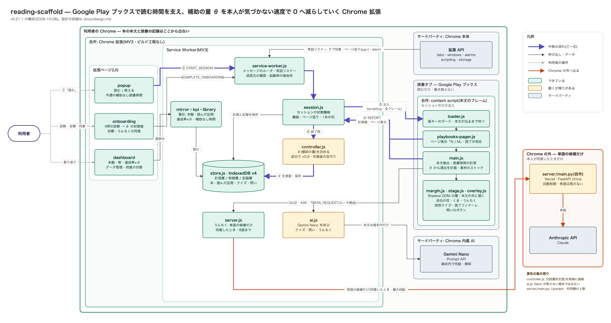
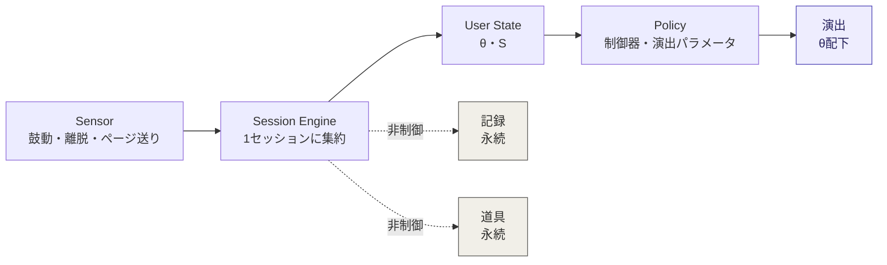
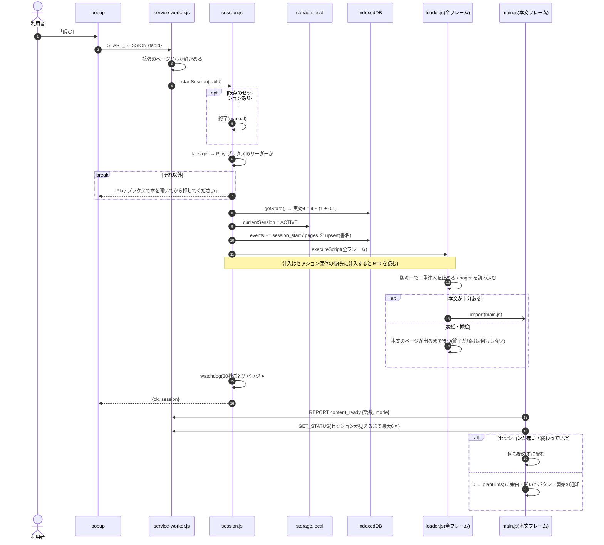
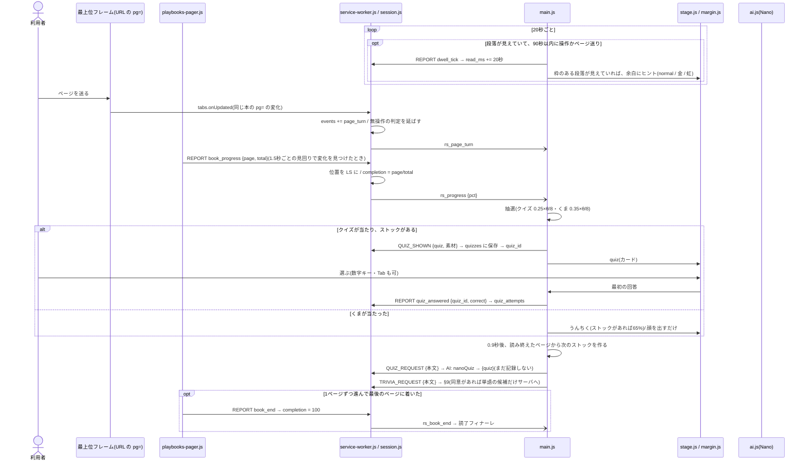
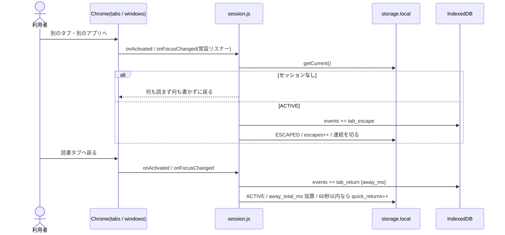
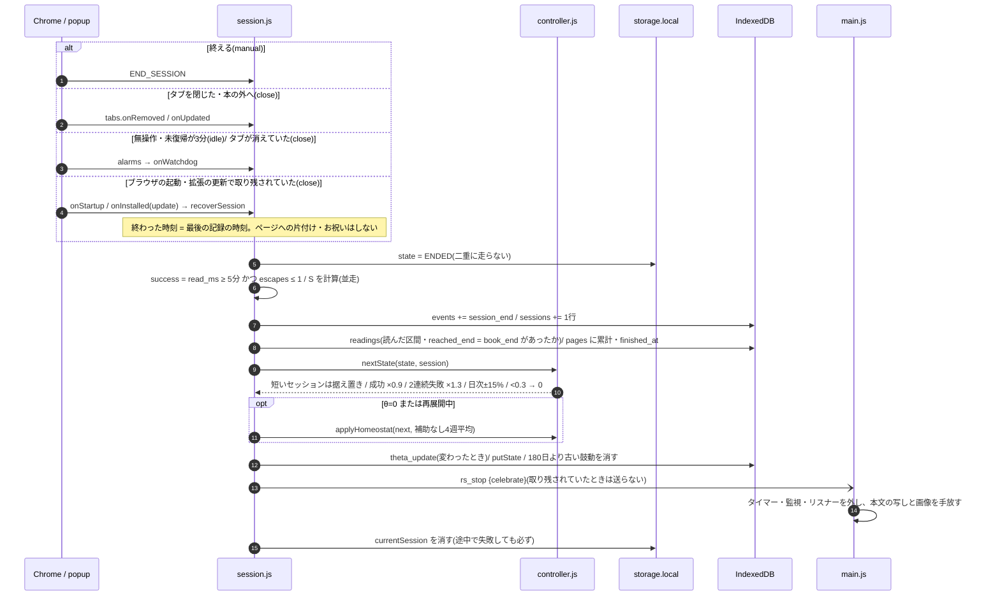
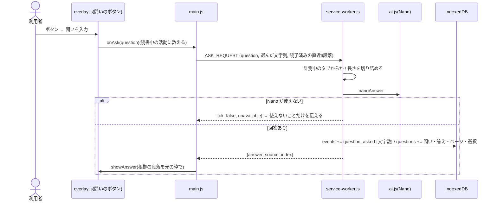
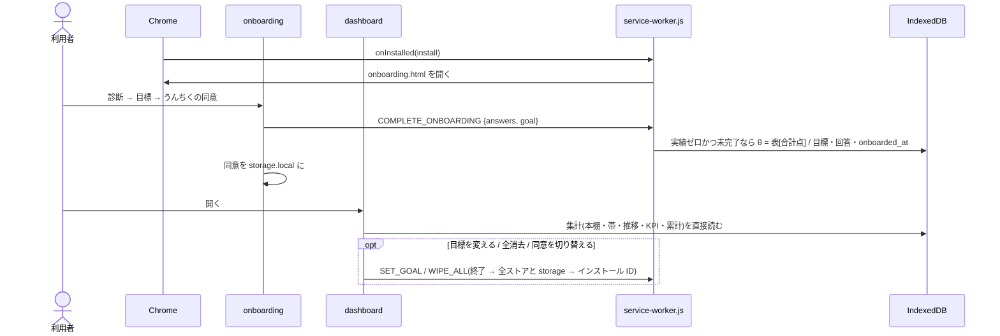

# 設計: reading-scaffold

- **Status:** 唯一の設計書(2026-10-08)。architecture-v1・data-design v2・reward-design・ask-and-nano-design・overview を統合した。旧版は [archive/](archive/)
- **対応コード:** v0.21.1。「計画」と書いた項以外は現物
- **対象:** Google Play ブックス(ウェブ版)専用。Web 記事の経路はコードに一部残るが、開始できない
- **関連:** 公開の手順は [release.md](release.md)、利用者向けの説明は [../PRIVACY.md](../PRIVACY.md)、サーバは [../server/README.md](../server/README.md)、文献は [research/](research/)

---

## 0. ひとことで

読書中だけ動く Chrome 拡張。読む時間を支える補助(余白の花・くま・突然クイズといった演出)を出し、その量 θ を**本人が気づかない速度で減らしていく**。補助がゼロになっても読めていれば成功(卒業)。読んだ記録と「自分からの問い」は減らさずに残す。

「ドーパミン」は利用者向けのメタファーで、システム変数ではない。システムが制御するのは**足場の量 θ ただ一つ**で、その目標値は常に 0。

### θ とは

θ は「本文1,000語(日本語は1,000字)あたり、ヒント・演出を何回出すか」を表す1本の数字。範囲は 0〜8。

| θ | 1,000字あたりの演出 | 地のきらきら | 意味 |
|---|---|---|---|
| 8 | 約8回 | 最も多い | 最大。診断で最も補助が要る人の初期値 |
| 4 | 約4回 | θ=8 のときの1/4 | |
| 1 | 約1回 | θ=8 のときの1/64 | |
| 0 | 出ない(クイズ・くま・フィナーレも出ない) | 出ない | 卒業。自分からの問いと記録は残る |

- **初期値:** オンボーディングの4問診断で 2〜8 に置く。以後 θ を動かすのは制御器だけ
- **動き方:** 成功したセッション(5分以上読み、離脱1回以下)ごとに 10% 減る。2回続けて失敗したら 30% 戻す。1日の変化は ±15% まで。0.3 を切ったら 0(卒業)。失敗がなければ 8 から成功32回、週3回で約11週
- **見せ方:** 変化は通知しない。セッションごとに ±10% の揺らぎを乗せて、下がる傾向を隠す。読書中の画面には θ を出さない(ストア版は開始の通知からも外す)。推移は本人がダッシュボードを開けば見られる

---

## 1. 三分法と、漸減する軸は一本だけ

すべての機能は次の三つのどれかに属する。どれにも属さない機能は作らない。両方の性質を持つものも作らない。

| | 演出(stimulus) | 記録(record) | 道具(tool) |
|---|---|---|---|
| 何 | 余白の花・地のきらきら・くま・うんちく・突然クイズ・読了フィナーレ | 本棚・帯・読んだ区間・余白(問いとクイズ)・累計 | 自分からの問い |
| 起点 | システム(θ+乱数) | 蓄積 | 本人 |
| θとの関係 | **θ配下。θとともに漸減し、卒業(θ=0)で消える** | 非制御。永続 | 非制御。永続 |
| 可変報酬 | あり(乱数・レア度) | **禁止**(決定的な蓄積のみ) | **禁止**(回答に演出をつけない) |
| 住処 | 読書中のページ上(本文の外) | ダッシュボード | 読書中のページ上(小さく) |

理由: **タペリングできない刺激装置を作ってはいけない**(愛着の湧いたものはフェードアウトできない)。永続するものからは可変報酬のループを構造的に外す。

- くまはペットではなく**演出**。育たない・お腹が空かない・要求しない。θ=0 で出なくなる。ペットにするなら記録カテゴリ(読書中の視界の外・一方向の蓄積のみ)に置く(旧 reward-design の判断)
- 「注意支援・理解支援・報酬・記憶」を別々の制御器にはしない。n=1 で4つの方策は同定できず、「減らすもの」と「残すもの」の線は三分法で引けている。**θ以外を制御しない**

---

## 2. 構成



紫の太線 ①〜⑤ が中核の流れ(読む → 開始 → 注入 → 計測 → 終了時に θ を更新)。橙の線が端末の外へ出る唯一の経路で、本人が同意したときに、端末で選んだ単語の候補(最大8語)だけが通る(§9)。黄色の箱は動くが残りがあるもの。図の元は [overview.svg](overview.svg)(素の SVG。直したら PNG を書き出し直す)。

- **Play ブックスのフレーム:** 最上位は `play.google.com/books/reader`、本文とページ表示は `books.googleusercontent.com` のフレームの中。ローダーは全フレームに入り、本体(main.js)は本文のあるフレームでだけ動く
- **ビルド工程なし。** ES モジュールをそのまま読む。ストア版かどうかは manifest の `update_url` の有無で見分ける(`IS_STORE_BUILD`)

### 論理パイプライン



実線の列だけが制御ループ。記録と道具は θ を読まないし書かない。

---

## 3. セッションエンジン(session.js)

```
IDLE ──[読む(popup)]──▶ ACTIVE
ACTIVE ──[タブ切替/ウィンドウ非フォーカス]──▶ ESCAPED ──[復帰]──▶ ACTIVE
ACTIVE/ESCAPED ──[終える / タブを閉じる / 本の外へ移る / 無操作3分]──▶ ENDED
```

- **開始は popup から**(ユーザー操作)。Play ブックスのリーダー以外では開始しない。host 権限が Play ブックスにしか無いので、他のタブは URL も読めない
- **同じ本**は URL の `id=` で判定する。ページ送り(`pg=` の変化)は終了ではなく `page_turn`。別の本・Play ブックスの外へ移ったら終了
- 離脱はセッションを終わらせない(離脱→復帰が制御の主要シグナル)。復帰なし3分で自動終了
- **計測はセッション中のみ:** tabs 系リスナーは service-worker.js のトップレベルに常設し(MV3 の再起動要件)、全ハンドラは最初にセッションを確かめ、無ければ何も読まず何も書かずに戻る
- **現在値は `chrome.storage.local`**。SW の再起動もブラウザの終了も跨ぐ。ブラウザの起動時(`onStartup`)と拡張の更新時(`onInstalled: update`)に、取り残されたセッションを**最後の記録の時刻で**閉じる。閉じていた間は読書時間にも離脱時間にも数えない(v0.21.1)
- **1本の列:** currentSession を読んで書き戻す処理(報告・離脱・ページ送り・終了)は SW の中で直列に走らせる。並べないと読了の瞬間の報告どうしが上書きし合う
- **終了は二重に走らない:** 最初に `ENDED` を保存してから記録を書き、最後に必ず現在値を消す
- 終了時にすること: 成否の判定 → (成功かつ θ>0 なら)読了のお祝い → `sessions` に集計 → `readings`・`pages` に記録 → 制御器で θ を更新 → 古い細かい計測の掃除 → content に片付けを頼む

### Sensor の操作的定義(main.js・playbooks-pager.js)

| 量 | 定義 |
|---|---|
| 読書時間 read_ms | 本文の段落が見えていて(IntersectionObserver 10%)、直近90秒以内に操作かページ送りがある間の、20秒の鼓動の合計。ページ送りの本は1ページ読む間に操作がないので、窓を90秒にしている |
| 離脱 escapes | タブ切替・ウィンドウ非フォーカスの回数。行き先は記録しない(読める権限がない) |
| 最長連続 longest_streak_ms | 鼓動が40秒以内に続き、離脱で切れない区間の最長 |
| 読了率 completion_pct | 本の中の位置(ページ表示 page/total)。段落の比率は使わない(読み込まれた分の中の位置なので途中でも100%になる) |
| 読了 | 1ページずつ進んで最後のページに着いたとき(pager の `book_end`)。スライダーや目次で飛んだ・最後のページで開き直した、は読了にしない |
| 読む速さ(v0.22) | ページを送るたびに、直前まで見えていた段落の語数と滞在時間(`page_read`)。離脱を挟んだページ・3秒未満・10分超・20語未満は標本にしない。セッションの終わりに 語数/分の中央値・変動係数・詰まった(中央値の1/2以下)/流した(2.5倍以上)ページ数を `sessions` に残す |
| 読み返し backs | ページ表示が前のページより手前へ動いた回数 |
| 本文 | `reader-rendered-page .main_text > div` の空でない段落(ルビの振り仮名は除く)。3段落・200語未満なら measure-only(演出なし・計測のみ) |

- 表紙や挿絵のページで始めたときは、ローダーが本文のページが出るまで待ってから本体を入れる
- 先読みされて画面の外にあるページの段落も DOM にあるので、「見えている」は可視の監視で判定する。同じ段落が作り直されても、本文の文字列で同じ番号として扱う
- 問いのボタンの操作と入力は「読書中の活動」に数える(問いの最中に放置終了させない)

---

## 4. User State: θ と S

### θ(現物)

- 単一レコード `state`: `{ theta, success_streak, fail_streak, day, day_start_theta, diag_answers, goal, onboarded_at, homeostat?, stair?, last_decision?, pace? }`(`stair` は階段法の事後分布・§5、`pace` は読む速さの持ち越し `{ wpm, cv, pages, updated_at }`・§6)
- **実効θ** = θ × (1 ± 0.1 の乱数)。日々±10%揺れる中を成功あたり10%下るので、下降がノイズに埋もれる(迷彩)
- **診断は事前分布を置くだけ:** 4問(各0〜2点)の合計 → `[2, 3, 4, 5, 5.5, 6, 7, 7.5, 8]`。セッションの実績が1つでもあれば、診断のやり直しは θ を触らない

### S(読書安定度)— 並走計測中(`SUCCESS.judge` で制御に接続できる)

二値の success(5分以上・離脱1回以下)は「20分読んで1回逸れた」と「5分ぎりぎり」を区別できない。Play ブックスでは5分の基準が緩く、θ と無関係に成功が並ぶ = 制御器に情報が届かない(replay の `flat` 読者)。S ∈ [0,1] を v0.14 から `sessions.stability` に並走で記録している。ルールベース(ML にしない)。

```
S = clamp( 0.45·dur + 0.25·escape + 0.15·return + 0.10·steady + 0.05·ending, 0, 1 )
dur     = min(read_min / 20, 1)
escape  = max(0, 1 − escapes/3) × max(0, 1 − away_total_ms/3分)
return  = 離脱のうち60秒以内に戻った割合(離脱なしは1)
steady  = max(0, 1 − 速さの変動係数)(標本が無ければ 0.5)
ending  = manual:1 / close:0.8 / idle:0.6
```

- v0.22 で `completion`(本の中の位置。その回の読み方と無関係に後半ほど高くなる)を `steady` に替え、`ending` の重みを下げた(終了ボタンを押したかどうかで成否が割れないように)
- **制御への接続:** `SUCCESS.judge = 'stability'` にすると、制御器は `outcomeOf` で S を3値に切って読む(S ≥ 0.7 成功・S ≤ 0.3 失敗・間は据え置き=学ばない)。既定は `'binary'`(v0.21 と同じ)。切り替えは並走データの一致率(`library.stabilityReport`)と replay を見てから

**S に入れないもの:** ヒント・演出の回数、クイズ正誤、問いの数、目標達成、連続日数、その他エンゲージメント指標。理解を制御に入れると「簡単な問題を出せば θ が下がる」自己目的化の回路ができる。理解は評価のガードレールにだけ使う(§10)。

---

## 5. 制御器(controller.js)

### タペリング(現物)

```
セッション終了ごとに:
  ごく短いセッション(読書1分未満・離脱なし = 誤って開始・本の切り替え)→ 成否に数えない
  success → success_streak++, fail_streak=0, θ ← θ×0.9      # 本人が気づける差(10〜20%)より小さい
  fail    → fail_streak++,    success_streak=0
  fail_streak ≥ 2 → θ ← θ×1.3                               # 戻すときは大きく(ヒステリシス)
  1日の総変化は ±15% まで
  θ < 0.3 → θ = 0(卒業。乗算は0に届かないのでスナップ)
```

### ホメオスタット(卒業後の見守り・v0.21.1)

- 卒業の瞬間に、補助なし読書時間(ヒント・演出ゼロのセッションの読書時間)の4週平均を**基準**として記録する
- 卒業(再卒業)から4週は見守るだけ(4週平均が卒業後の読書を映すまで待つ)。基準が0だったときは、4週たった時点の週平均を基準にする
- その後、4週平均が基準の **50%** を切ったら θ=1.5 へ一時再展開する(1日の変化幅の基準も1.5に置く)
- 再展開中も**通常の漸減は続く**(目標は常に0)。4週平均が基準の **80%** まで戻るか、漸減で0に着いたら再卒業
- 文献(research/fading.md): 乗算的な減衰は減薬の標準形式と同型。パンの減塩 RCT(週5%・累積25%で気づかれない)が「気づかれない漸減」の実証例

### 閾値推定(staircase.js・v0.22・`CONTROLLER.policy = 'staircase'` で有効)

固定則の弱点は、`tools/replay` の模擬読者で数字になる: 閾値の高い人(`heavy`)を**成功率4〜5割の θ に留め続ける**(×0.9 と ×1.3 の釣り合う点が p≈0.5)。一方で成功基準が緩い人(`flat`)には33回のタイマーにすぎない。

階段法は、その人の「θ がこれだけあれば読める」閾値 τ をセッションの成否からベイズ推定する(心理物理学の QUEST と同じ考え方。n=1・数十回で収束する)。

```
P(成功 | θ, τ) = γ + (1 − γ − λ) · σ((log θ − τ) / w)      γ=0.15 λ=0.1 w=0.5
事後分布は log θ のグリッド(0.05 〜 8×e^1.5・64点)上の重み。初期は一様(診断の θ は最初の量であって閾値の見込みではない)
目標点 θ* = exp(τ̂ + 余白)   余白 = w·logit((0.75 − γ)/(1 − γ − λ)) ≈ 閾値 × 2

成功 → θ ← θ×0.9(固定則と同じ。閾値から遠いあいだ、成功は「閾値はもっと下」としか言わない)
       ただし事後分布が狭く(sd ≤ 0.5)、θ×0.9 < θ* なら据え置き(閾値の余白の中では下げない)
失敗 → θ* > θ×1.05 なら θ ← θ*(= 最後に読めていた θ の記憶へ戻る)。閾値から遠い失敗は生活のノイズとして動かない
毎回、事後分布を sd 0.12 のガウス核でぼかす(忘却。据え置きが続いても失敗の記憶は薄れ、習慣で閾値が下がれば再び下り始める)
1日 ±15%・θ<0.3 で卒業 は固定則と同じ
```

- fading.md の推奨 ①(失敗時は最後に安定していた θ へ)②(卒業直前は刻みを細かく)は、この形に含まれる。③(再展開は低く始める)はホメオスタット側で未対応
- `STAIRCASE.exploreHoldP`(既定 0): 下げる場面でもこの確率で据え置き、「下げたせいで読めなくなったか」を後から比べられるようにする(micro-randomization)。卒業が遅れるので開発者のプロフィールでだけ使う
- 模擬読者での比較(replay、300人・16週): `heavy` の成功率 49% → 69%、`light`・`flat` は固定則と同じ、`typical` は成功率 73% → 78% と引き換えに12週以内の卒業が 54% → 24%(閾値を尊重するぶん遅い)。本物の記録では `replay --export` で θ の軌跡を比べる
- 日次±15% は文献の根拠がない。工学的な裁量と明記して残す

---

## 6. 演出(Play ブックス)

演出は**本文の外**に描く。読んでいる文字の上には何も重ねない。画風は絵本・水彩(paint.js が形を一度だけ焼き、毎フレームは位置と透明度だけを変える)。大きく画面を覆うのは、突然クイズと読了フィナーレの決まった瞬間だけ。

### 余白(margin.js)

- 本文の枠の外の帯(縦書きは上下、横書きは左右)から描く場所を選び、描くたびに本文の枠を切り抜く
- **地のきらきら:** 読んでいる間、1.5秒ごとに (θ/8)² × 0.35 の確率で、余白の一点に小さな星が瞬く。銀
- **ヒント(θの枠):** normal は小さな花が咲いて花びらが流れる。rare は金の花がいくつも、epic は星が二度瞬いてから水彩の虹の帯。文字のカードは出さない

### めくった直後の出来事(PAGE_EVENTS・stage.js)

ページを送るたびに抽選し、当たれば出す(出たり出なかったりする=可変報酬)。開始から2回のめくりまでは何も起きない。出す時刻は、本人の読む速さが分かっているかで変わる(下の「読む速さに合わせた出し方」)。

| 出来事 | 1回のめくりで出る確率 | 間隔 | 中身 |
|---|---|---|---|
| 突然クイズ | 0.25 × θ/8 | 2分以上 | 画面全体のカードに3択。間違えても「おしい!」で選び直せる。正解で花火・花びら・ことば吹雪 |
| くま | 0.35 × θ/8 | 45秒以上・クイズの後20秒は出さない | 画面の下の隅から顔を出す。65%でうんちくを一言、それ以外は顔を出すだけ |

- クイズは生成に数秒かかるので、**読み終えたページ**(既読で、いま見えていない段落・最大1,500字)から先に作ってストックしておき、めくった 0.6 秒後に出す。未読のページからは作らない(ネタバレ禁止)
- 速さが分からないうちは、うんちくも同じ(前のページから作ってストック、めくった直後に「さっきのページの「語」より」)
- ストックは古くなったら捨てる(クイズ6めくり・うんちく4めくり)。作れなかったら3めくり空けてから作り直す

#### 読む速さに合わせた出し方(v0.24・`PAGE_EVENTS.paced`)

「前のページの話を、めくった直後に」ではなく、「いま読んでいるページの語の話を、その語を確実に読み過ぎた頃に」出す。

- **速さの推定:** このセッションの標本(`page_read` と同じ語数/滞在時間、同じ絞り)と、前回までの持ち越し `state.pace`(語/分の中央値・変動係数・ページ数。セッションの終わりに 6 ページ分の重みで混ぜる)を、ページ数で重み付き平均する。合わせて 3 ページ分の標本が無ければ使わない(従来の出し方)
- **位置の推定:** めくってからの時間 × 速さ。語の位置は、いま見えている段落を読む順に並べて、その語が最初に出る所までの語数
- **出す時刻:** 本人の速さの 0.8 倍で読んでいるとして、語を読み終える時刻に、変動係数の分(cv × 1.0)だけさらに遅らせる。めくってから 4 秒未満には出さない。本人の速さそのままでのページの終わりの 8 秒手前より遅くなるなら出さず、次のめくりで「さっきのページの」として出す(持ち越しは 1 めくりまで)。150 秒より先の予定は立てない
- **素材:** 当たったときに、いま見えているページ(最大1,500字)から端末内の Nano で作る。語が本文に見つからない・生成が遅かった、も次のめくりに持ち越す(ネタバレをしない側に倒す)
- **顔を出すだけ:** ページの 45% を読み過ぎた頃(同じ遅らせ方。6 割にすると、遅らせた分でページの終わりに掛かって出なくなる)
- 抽選・頻度・派手さは変えない(θ 配下のまま)。速さの推定は計測・制御・記録には使わない。記録には `hint_shown.timing`(`turn` / `paced`)を残す

#### くまの置き場所

画面の下の左右どちらかに出す。本文の枠(いま見えている段落の矩形)と重なる面積が小さい側を選び、同じなら読んでいる推定位置から遠い側(横書きの見開きは前半が左ページなので前半は右に、縦書きは逆)。推定が無ければ左右は乱数。吹き出しは出した側に付く
- クイズは**出したときに記録する**(先に作っただけの問題は本棚に残さない)
- 派手さは intensity(θ/8)に比例する。θ が高いほど祭り、低いほど静か
- めくるたびに花びらを降らせる演出(PAGE_SHOWER)と、紙の角がめくれる演出(PAGE_CURL)は、読書の邪魔だったので止めてある

### 読了フィナーレ

1ページずつ進んで最後のページに着いた瞬間に1回だけ。水彩の虹が描かれ、本の帯に「読了!!」、花火とことば吹雪、旗を振るくま。大きさは θ に比例し、θ=0 では出さない。

### θ → 演出パラメータ

| パラメータ | 導出 |
|---|---|
| ヒントの枠 | θ × 本文語数 / 1000。後から読み込まれたページの段落にも、端数を持ち越しながら割り当てる。Play ブックスでは枠どうしを30秒以上空ける |
| 枠の置き場所(v0.22) | 段落の難しさ(`content/difficulty.js`: 文の長さ・漢字の割合・漢字の連なり。端末内の目安、AI なし)で重み付けして選ぶ。重み = (0.1+難しさ)^k、k = 3×(1−θ/8)。θ=8 で一様、θ が下がるほど難しい段落に寄る — **易しい所から先に消える**(足場の随伴的な漸減)。枠の数は変えない・どこに出るかは乱数のまま |
| 突然クイズの焦点(v0.22) | 読み終えたページで最も難しい段落を Nano に「特にここ」と渡す。頻度は θ 配下のまま、随伴性の重心を「読む→光」から「わかる→光」へ(research/reward.md 3-3) |
| レア度 | 計画時に**事前ロール**: epic 2.5% / rare 12% / normal。頻度は θ、大きさは乱数 |
| 先触れ | レア以上が4段落先までに待つと、地の星が金(激レアは虹)に変わる。約1分で発火を保証 |
| 天井 | θ>0 で演出ゼロの実読書が `clamp(12/θ, 3, 15)` 分続いたら normal を1回。残り時間は示さない |
| 地のきらきら | (θ/8)² × 0.35 / 1.5秒 |
| 突然クイズ・くま | 上の表。確率も派手さも θ/8 に比例 |
| セッション成功のお祝い | success かつ θ>0 のときだけ、余白に金の花 |

**色の語彙:** 銀=通常 / 金=レア確定 / 虹=激レア確定。外れ予告が存在しないので、「色=大きさ」が言葉なしで100%信頼できる語彙として学習される。

### 予期の設計とパチスロの移植基準

ドーパミンは報酬の受け取りではなく**予測誤差とcue(予告)**で出る(Schultz 1997)。だから頻度に加えて大きさを予測不能にし、予告で期待の瞬間を作る。ただし**予告は必ず当たる**(期待を裏切るのは良い方向だけ)。

- **移植する:** 可変比率(いつ出るか=θ+乱数)、可変マグニチュード(レア度)、予告(先触れ・二度瞬き)、天井(下限保証)
- **移植しない:** リーチ(ニアミス=悔しさ駆動)、確変・ラッシュ(継続圧力)、ゾーン(来訪圧力)、ストリーク、音・振動、収集・在庫、残り回転数の表示
- 間欠強化は消去に強い(Humphreys 1939)= θ のタペリングに有利。ただし守られるのは「読む行動」で、演出への愛着ではない。θ が下がるにつれ、随伴性の重心を「読む→光」から「わかる→光」(クイズ)へ移す

### 言葉の原則

**言葉で褒めない・教えない。** 報酬は雰囲気(光・間・動き)で伝える。出してよい言葉は事実(進捗・経過分)だけ。禁止: 相槌(「いい調子」)、労い(「おつかれさま」)、解説・要点・教訓・アドバイス。LLM の出力にも適用する。

例外(どれも意図して置いたもの):

1. **本人が問うたことへの回答**(呼び出し式・§7)
2. **ピークの瞬間の言葉:** クイズ正解の「正解!」「大当たり!!」、読了の「読了!!」、誤答の「おしい!」。`PAGE_EVENTS.words = false` で消せる
3. **くまのうんちく:** 読み終えたページの言葉の意味や読み、実在の物事について一言。「教える」に近いが、θ 配下の演出として扱い、θ とともに減り、卒業で消える。辞書・事典で確かめられることだけを話し、本文の先の展開・要約・感想・褒め・アドバイスは書かない。自信がなければ黙る

---

## 7. 道具: 問い(現物)

- 本文フレームの右下に小さな半透明のリング(問いのボタン)を常設。クリックで入力欄。**1問1答**(会話は続かない=読書から連れ出さない)
- 文脈は読了済みの直近6段落と、選んでいる文字列。未読の部分は渡さない(ネタバレ禁止)
- 回答は2〜3文。根拠の段落を光の枠で指す(「照らす、答えない」)。先回りの要約はしない(要約アプリ化は Non-Goal)
- **端末内の Nano だけで答える。** 本文と質問は端末の外へ出さない。Nano が使えない端末では、使えないことだけを伝える
- **回答に演出をつけない**(つけると質問がレバーになり、興味の指標も汚れる)
- 記録: `questions` に問い・答え・その時のページ・選んでいた文字列。計測層の `question_asked` には文字数だけ
- **制御器には入れない。** ダッシュボードの累計に「自分からの問い」を事実として出すだけ
- 卒業の定義「刺激の起点が自分になる」の実体。システムの演出が減るにつれ、自分の問いが増えるのが理想の軌跡

---

## 8. 記録とデータ(store.js・IndexedDB v4)

### 3層

| 層 | ストア | 中身 | 本の URL・本文 | 行き先 |
|---|---|---|---|---|
| 計測層 | `events`(append-only) `sessions`(集計) | 鼓動・離脱・ページ送り・ヒント/演出/クイズ/問いの発生 | 持たない | ローカルのみ |
| 制御層 | `state`(単一) | θ・streak・診断・目標・ホメオスタット | 持たない | ローカルのみ |
| 記録層 | `pages` `readings` `quizzes` `quiz_attempts` `questions` `marks` `memory_items` `recalls` | 読書メモリ=本人の資産(記憶の層を含む) | **持つ** | **ローカルのみ** |

- 増やすのは記録層だけ。計測層は意図的に貧しいままにする。本の中の位置も記録層に置く
- **単位は「本」と「箇所」。** 本=`pages` の1行(Play ブックスの URL の `id=` で1冊。ストア名は IndexedDB が改名できないので据え置き)。読んだ区間=`readings` の1行(1セッション=1区間)。箇所=本のページ番号(ページ表示「N / M」。見開き「4-5 / 17」は後ろのページ)
- **本人が起点の痕跡**(問い・選んだ箇所・主張)を、システムが作ったもの(クイズ)より上に置く

### ストアの中身

```
sessions  { session_id, date, started_at, domain, page_id, theta, theta_base, read_ms, escapes,
            completion_pct, success, stability, reason, away_total_ms, quick_returns,
            hints_shown, effects_shown, longest_streak_ms,
            pages_read, pace_wpm, pace_cv, slow_pages, fast_pages, backs }   # v0.22 読む速さ
pages     { page_id(正規化URLの SHA-256), url, title, domain, lang, word_count,
            first_read_at, last_read_at, read_count, total_read_ms, best_completion_pct,
            book_position { page, total }, finished_at }
readings  { session_id, page_id, date, started_at, ended_at,
            range { from, to, furthest, total }, page_turns, read_ms, reached_end }
quizzes   { quiz_id, page_id, paragraph_hash, paragraph_excerpt, book_page,
            question, choices[3], answer_index, created_at }
quiz_attempts { attempt_id, quiz_id, page_id, session_id, answered_at, chosen_index, correct, latency_ms }
questions { question_id, page_id, session_id, book_page, selection, question, answer, created_at }
events    { id, session_id, t, type, payload }
          type: session_start / dwell_tick / scroll / tab_escape / tab_return / page_turn / hint_shown /
                hint_clicked / effect_shown / quiz_answered / question_asked / session_end / theta_update /
                page_turn / page_read { words, ms, d }
```

- `title` はタブのタイトルから「 - Google Play Books」を除いたもの
- `readings` は Play ブックスでページ表示が一度でも読めたセッションだけが書く。セッション中の位置は `chrome.storage.local` の別キー(`bookPosition`)に置く(currentSession に相乗りすると上書きし合う)
- `pages` の集計値は導出キャッシュ。真実は `sessions` と `readings`
- `chrome.storage.local` の設定: `demo_enabled`(演出の増幅のみ・既定OFF)、`trivia_server_consent`(うんちくのサーバ・既定OFF)、`install_id`(回数制限用のランダムな ID)

### 保持・消去・持ち出し

- 細かい計測(`dwell_tick`・`scroll`・`page_read`)は **180日** で消す。それ以外(セッションの集計・本・区間・クイズ・問い)は本人が消すまで残す
- 全消去は1タップで全ストアと storage を空にし、インストール ID も消す(記録層=資産・記憶の層も含む)
- エクスポートは JSON(資産なので持ち出せる)

### ダッシュボードで出すもの

すべて事実の表示。可変報酬・比較・警告・催促はしない。卒業後も残るのは記録なので、本の節を θ の節より上に置く。

1. **本棚** — 本ごとに今の位置と、読み終えるまでの残り時間(残りページ ÷ その本での自分のペース)。読み終えた本は分ける
2. **1冊の帯** — 本の長さを横棒にし、読んだ区間を読んだ回数の濃淡で塗る。問い(輪)とクイズ(点)をページの位置に打ち、しおりで今の位置を示す。開くと「余白」(問い・選んだ箇所・クイズをページ順に)と「読んだ日」
3. **θ の節** — 帯(自立度 1−θ/8 を白→黄→緑→茶→黒の色で。黒が卒業)、自立の推移、週次目標の達成率、週次推移
4. **累計とデータ** — 読書時間・補助なし時間・読み終えた本・クイズ・問い。エクスポート・全消去・うんちくの同意・内蔵AIの確認

### 記憶の層(memory.js・shared/fsrs.js・v0.23)

読んだものが自分の知識として残る、の実体。原則は **retrieval practice(自分で思い出す)> LLM の要約**。LLM が要約して溜めたものは数ヶ月でゴミになる。本人が残した・問うた・答えたものだけを「思い出す項目」にする。記録カテゴリなので、演出なし・褒めない・催促しない。

```
marks         本人が残した主張  { mark_id, page_id, session_id, kind: 'claim', book_page, text, created_at }
memory_items  思い出す項目      { item_id: 'claim:N'|'question:N'|'quiz:N', kind, target_id, page_id, created_at,
                                  D, S, reps, lapses, last_review, due }      # FSRS の状態
recalls       想起の記録(追記のみ) { recall_id, item_id, kind, page_id, grade, correct, chosen_index, response,
                                  answered_at, elapsed_days, retrievability, days_since_read, before{D,S}, after{D,S} }
```

| 項目 | いつできる | 手がかり | 見せるもの | 評価 |
|---|---|---|---|---|
| 主張 claim | 成功セッションの終わりに popup で一文を書いたとき(書かなければ何も残らない) | 書名 +「いちばん大事と残したことは?」 | 本人の一文 | 本人: 思い出せなかった / おぼろげに / はっきり |
| 問い question | 本人が読書中に問うたとき(`questions`。問うた時点が最初の復習) | 本人の問い | 選んでいた箇所と、そのときの答え | 同上 |
| クイズ quiz | 突然クイズに答えたとき(最初の回答が最初の復習) | 問題と3択 | 正解 | 正誤で自動(自己評価は聞かない) |

- **間隔は FSRS-5**(Anki が採用する、個人の忘却曲線を復習の記録から当てはめるスケジューラ)。難しさ D と安定度 S(記憶が 90% 残る日数)を項目ごとに持ち、思い出せる確率が 0.9 まで落ちる日に出す。はっきり思い出せると 3日 → 11日 → 35日 → 101日 と伸び、思い出せないと S が大きく縮む。重みは既定値(本人の記録での最適化は `recalls` が数百件たまってから)
- **場所はダッシュボードの「思い出す」節だけ。** 期日が来たものを古い順に最大5件。自分で思い出し(書いても書かなくてもよい)→「見る」→ 自分で評価。評価のあとは「また N日ほどたったら」の一行に置き換わる(事実。演出なし)。無視すれば次に開いたときまで出ない
- **LLM は使っていない。** 手がかりは本人の言葉(主張・問い)か、出題済みのクイズ。Nano で「別の手がかり」を作る案は、主張の内容を漏らさない保証が要るので見送り
- **主張は余白に出る**(帯のひし形・余白の一覧の先頭)。本人が起点の痕跡を、システムが作ったもの(クイズ)より上に置く
- ダッシュボードの累計に「残した主張」と「7日後・30日後に思い出せた a / b」(読んでからその日数以上たった想起のうち、おぼろげ以上で思い出せた割合)を出す。その場の正答率より、これが「残っていること」の事実
- `passages`(箇所)は作っていない。主張は本、問いは選んでいた箇所をすでに持つので、箇所の表が要るのはハイライト(Open Question 5)を取るときになってから

---

## 9. 生成基盤と端末の境界

**本の本文は端末の外へ出さない。** Google Play の利用規約は、購入したコンテンツの送信・再配布を禁じている(2026-10-07 に確認し、この方式に決めた。法的な判断ではないので、公開前に専門家の確認を勧める)。

| 生成 | どこで | 渡すもの |
|---|---|---|
| 突然クイズ | Gemini Nano(端末内) | 読み終えたページの本文 |
| 問いへの回答 | Gemini Nano(端末内) | 問い・選んだ文字列・読了済みの段落 |
| くまのうんちく | 同意あり: サーバ(Vercel → Anthropic)。返事がなければ Nano / 同意なし: Nano | サーバへは**端末で選んだ単語の候補だけ**(最大8語・1語16字まで)。文・段落・書名・URL は送らない |

- **Nano(ai.js):** Prompt API。JSON Schema で出力を強制し、入出力言語 ja/en を宣言する。`downloadable` なら裏で一度だけダウンロードを起こし、それまでは何も出さない。ダッシュボードの「内蔵AIを確認・準備」がページの文脈で確実にダウンロードを始める。Chrome 138 以降が要る
- **単語の候補(`pickTerms`):** 2〜6字の漢字の連なり、3字以上のカタカナ(擬音らしいものを除く)、8字以上の小文字始まりの英単語から、長さと珍しさで選ぶ
- **サーバ(server/main.py):** `/trivia` と `/healthz` だけ。インストール ID ごと・IP ごと・全体の1日の回数制限、入力は8語・各16字まで(それ以外の項目は拒否)、単語と文はログにもファイルにも残さない。詳細は [../server/README.md](../server/README.md)
- **生成の依頼は、計測中の Play ブックスのタブからだけ受ける。** セッションの外・別のタブ・終わった後に届いた先読みからは何も作らない
- どれも作れなければ静かに諦める(読書を壊さない)。AI の出力はすべて文字として入れる(XSS なし)

---

## 10. オンボーディングと評価

### オンボーディング(現物)

```
インストール(onInstalled: install)→ onboarding.html
  導入 → 4問診断 → 目標を選ぶ(おすすめを事前選択)→ うんちくのサーバを使うか(既定オフ)→ 完了
  COMPLETE_ONBOARDING: θ の初期値は「セッション実績ゼロかつ未完了」のときだけ置く
```

- 診断結果を「中毒度スコア」として見せない(ラベリングは責めない原則に反する)
- ダッシュボードの「診断をやり直す」(Recalibrate)は目標と回答だけを更新し、θ は触らない

### 評価レイヤー(kpi.js)

- 主KPI = **週次目標の達成率 × θ の推移**。達成率を保ったまま θ が下がり続けることが、補助に依存せず読めている証拠。θ を下げると達成が崩れるなら機構の失敗(根拠: research/benchmark.md §5)
- 段階別の目標(本人が選ぶ・制御器は読まない): L1 成功セッション週3 / L2 週5+連続の中央値10分 / L3 補助なし週60分
- 理解のガードレール: クイズ正答率(今週と全期間)を対で出す
- **制御と評価の分離:** 制御用の success/S の定義は固定。段階で厳しくなるのは評価用の目標だけ
- 達成率は本人が開くダッシュボードにだけ、事実として出す(未達の警告・赤・催促なし)。popup には出さない

### 合格ライン(2026-09-14 確定・`config.PASS`)

| 項目 | 値 | 根拠 |
|---|---|---|
| 達成率の下限 | 選んだ段階の目標に対して週 **80%以上** を、直近 **4週のうち3週** | benchmark.md「80%以上を4週継続」を1週の取りこぼし許容に |
| 卒業の期限 | 開始から **12週** 以内に θ=0 | 8→0.3 に成功約32回。週3回で約11週+余裕 |
| 卒業後の維持 | 補助なし読書時間の4週平均が基準の **50%** を割らない(割れば再展開) | fading.md・Lally 2010 |
| 理解の非劣化 | クイズ正答率が全期間平均より **10ポイント** 以上下がらない | 時間だけの最大化を防ぐ |

一文で: **12週以内に θ を 8→0 にし、その間、週次達成率80%以上を4週中3週で保ち、クイズ正答率を落とさない。** 達しなければ機構の失敗と判定する。

---

## 11. 不変条件(コードで守るもの)

ここが唯一の一覧。README・コードのコメントはここを指す。

1. **ページを改変しない。** 追加するのは Shadow DOM の中の層だけ。ページの要素に属性も付けない。演出は本文の外に描く
2. **計測はセッション中のみ。** 常設リスナー+全ハンドラの先頭でセッションを確かめる
3. **θ の目標値は常に0。** 制御器の入力は行動シグナル(read_ms・escapes・away・return・読む速さ・終了理由)だけ。クイズ正誤・問いの数・演出数・目標・連続日数などは入れない
4. **予告は必ず当たる。** ニアミスを作らない。先触れ・二度瞬きは必ず本演出で回収する
5. **演出は θ 配下、記録に可変報酬なし、道具に演出なし。** タペリングできない刺激装置を作らない
6. **言葉で褒めない・教えない。** 例外は §6 の3つ(呼び出し式の回答・ピークの言葉・くまのうんちく)だけ
7. **本の本文は端末の外へ出さない。** 本文を扱う生成は Nano だけ。外へ出るのは、同意したときの単語の候補だけ。外へ送るものを増やすなら、規約・PRIVACY.md・同意の文言を先に見直す
8. **記録はローカルのみ。** 計測・θ・読書メモリは IndexedDB に置き、サーバへ出さない
9. **制御用の success/S と評価用の目標を分ける。** 途中で制御の力学を変えない
10. **デモは演出の増幅にだけ効く。** プロフィールごと・既定OFF。ストア版では開発用の機能(θ の手動上書き・デモ・デモデータ投入・開始の通知の θ と版)を出さない

---

## 12. これまでとこれから

| 日付 | 版 | できたこと |
|---|---|---|
| 8/16 | v0.1〜0.8 | 計測・演出・θ の自動漸減とホメオスタット・ダッシュボード |
| 8/31 | v0.9 | KPI を「週次達成率 × θ」に |
| 9/02 | v0.10 | オンボーディング(診断 → θ の初期値・目標) |
| 9/05 | v0.11 | 演出 v2(色の語彙・先触れ・天井) |
| 9/07 | v0.12 | 自分からの問い・Gemini Nano |
| 9/10 | v0.13 | デモモードを実行時トグルに |
| 9/14 | v0.14 | S の並走計測・Recalibrate・合格ライン |
| 10/07 | v0.20 | Play ブックス対応・絵本の演出(くま・突然クイズ・うんちく・読了フィナーレ・余白)・読んだ区間(DB v4)・本棚 |
| 10/07 | v0.21 | 本文を端末の外に出さない(方式B)・Play ブックス専用・うんちくサーバを Vercel へ |
| 10/08 | v0.21.1 | レビューの残り: セッションをブラウザ終了で失わない・読了判定・ホメオスタットの罠・ページ側の後片付け |
| 10/08 | v0.22 | 再生ハーネス(`tools/replay`)・閾値推定の制御器(staircase・既定OFF)・読む速さのセンサー・S の steady 項と judge・難しさで枠を配分 |
| 10/08 | v0.23 | 記憶の層(DB v5): 主張のカード・ダッシュボードの「思い出す」・FSRS-5 の間隔・想起の記録 |
| 10/08 | v0.24 | 読む速さに合わせた出し方(うんちくを、その語を読み過ぎた頃に)・くまの置き場所・速さの持ち越し `state.pace` |

### これから

1. **Chrome ウェブストアに出す** — 製品名・アイコン・掲載文・プライバシーポリシーの公開([release.md](release.md))。固定則・binary のまま出し、これをベースラインにする
2. **自分の記録で検証してから切り替える** — ダッシュボードの JSON を `replay --export` に通す(fixed が記録を再現するか・staircase の軌跡)。速さと S の並走データがたまったら `SUCCESS.judge = 'stability'`、次に `CONTROLLER.policy = 'staircase'`
3. 記憶の層の続き: 想起の記録が数百件たまったら FSRS の重みを本人の記録で最適化。ハイライト(選んだ箇所の記録)を取るなら `passages` を足す
4. 難しさの目安が弱ければ Nano で「概念の密度」を採点(毎ページ生成のコストと引き換え)。ダッシュボードに速さ・閾値の推定を事実として出す(開発用)
5. 他人の環境で動くか: Play ブックスの画面の変化への追従、Nano が使える端末の割合

### Open Questions

1. S の係数と閾値(0.7/0.3)は仮。「idle 終了=0.3」は厳しすぎるか
2. 想起カードの出しどころ(成功セッションの終わりだけか)と、「要求しない」との両立
3. Nano が使えない端末が多いとき、クイズと問いを出さないままでよいか(本文は外に出せない)
4. テーマ付けに LLM を使うか。使うなら「教えない」原則との線引き
5. `selection` を問い以外でも取るか(ハイライト)。取るなら道具カテゴリの UI が要る
6. リフローする本はウィンドウ幅や文字の大きさで総ページ数が変わりうる。本ごとの読んだ区間に違う尺度が混ざる

---

## 付録 A: シーケンス図

関数名・メッセージ名はコードのまま。実線は呼び出し・送信、点線は応答。`LS` は `chrome.storage.local`(セッションの現在値)、`DB` は IndexedDB。

### A1. セッション開始



### A2. 読書中: 鼓動・ページ送り・めくった直後の出来事



- 生成の依頼は、計測中のタブ以外からは断る(sessionOf)
- 送るのは計測値と、Nano に渡す読み終えたページの本文だけ。本文は SW の中で Nano に渡り、端末の外へは出ない

### A3. 離脱と復帰



### A4. セッション終了と制御器



- θ の変化は本人に通知しない。制御器に渡るのは行動シグナルだけ
- 記録・制御の失敗は終了処理を止めない

### A5. 問い(道具)



### A6. オンボーディングとダッシュボード



- 読み取りは拡張のページから直接、書き込みは SW 経由(state への書き込みを制御器と揃える)
- 特権の操作(開始・終了・全消去・目標・オンボーディング)は拡張のページからだけ受け、読んでいるページに入ったスクリプトからは受けない
