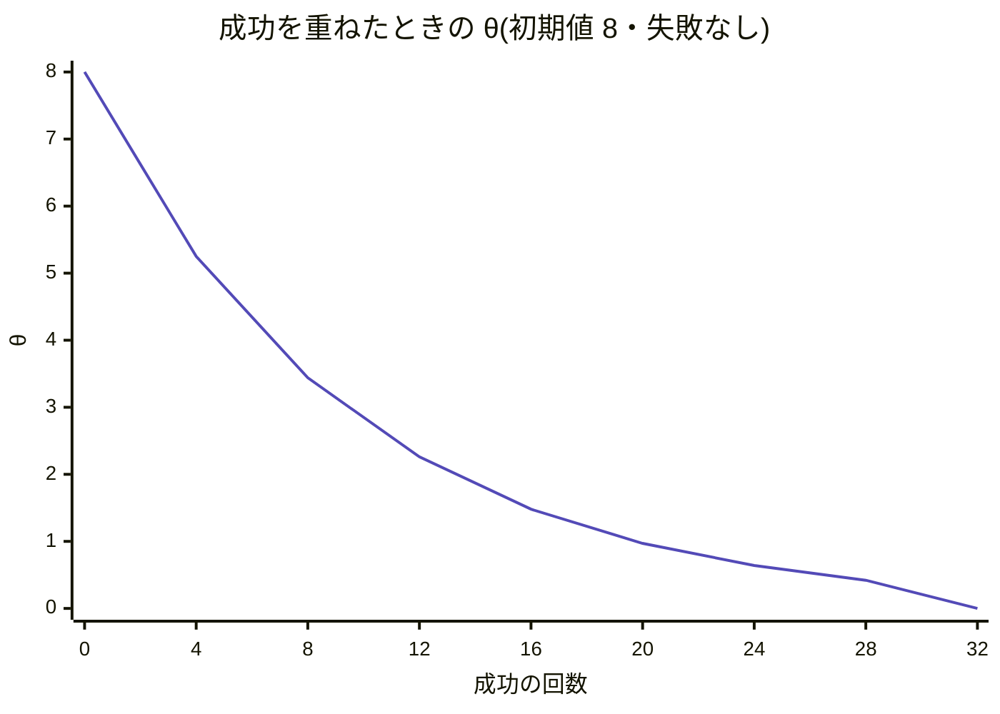
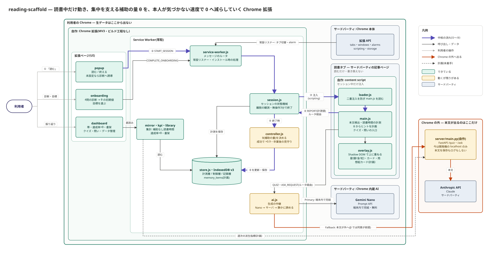
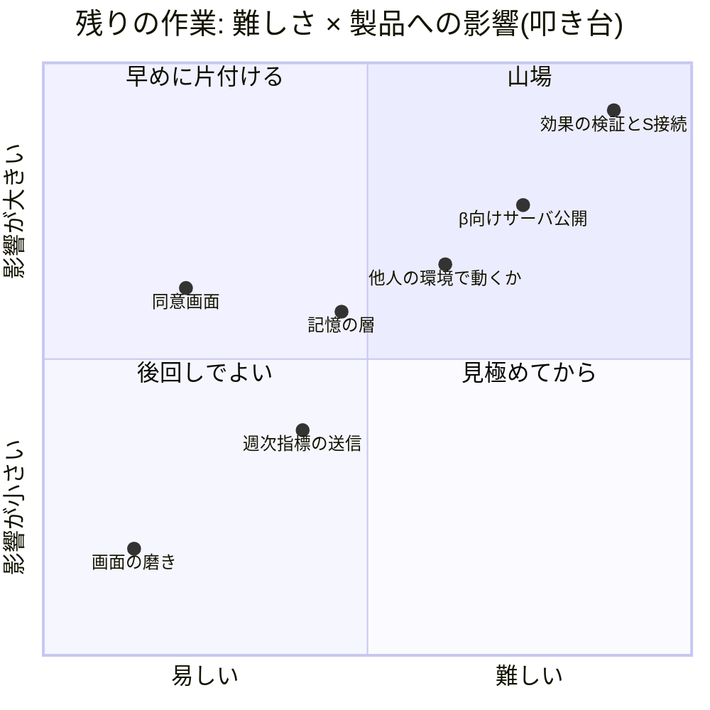
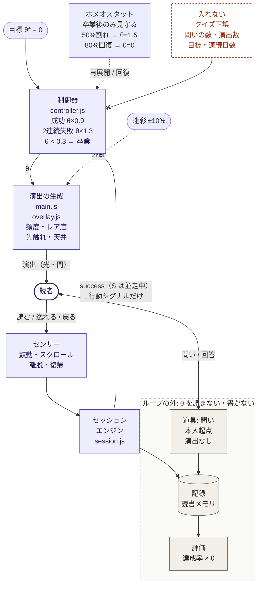

# reading-scaffold 全体像

- **Status:** 2026-09-28・v0.14.2 時点
- **Audience:** マネージャーと、これから関わる人。組み立て・進み具合・難所を1ページで掴むための資料
- **詳細:** 設計の一次資料は [architecture-v1.md](architecture-v1.md)、処理の順序は [architecture-v1.md の付録 A](architecture-v1.md#付録-a-シーケンス図)

---

## 0. ひとことで

読書中だけ動く Chrome 拡張。集中を支える補助(ヒント・星・光・クイズといった演出)を出し、その量 θ を**本人が気づかない速度で減らしていく**。補助がゼロになっても読めていれば成功(卒業)。読んだ記録と「自分からの問い」は減らさずに残す。

### θ とは

θ(シータ)は**補助の量を表す1本の数字**で、「本文1,000語あたり、ヒント・演出を何回出すか」を表す。範囲は 0〜8。システムが制御しているのはこの数字だけ。

| θ | 3,000語の記事で出るヒント・演出 | 地の星(常にうっすら光るきらきら) | 意味 |
|---|---|---|---|
| 8 | 約24回 | 最も多い | 最大。診断で最も補助が要る人の初期値 |
| 4 | 約12回 | θ=8 のときの1/4 | |
| 1 | 約3回 | θ=8 のときの1/64 | |
| 0 | 出ない(クイズ・読了のお祝いも出ない) | 出ない | 卒業。自分からの問いと記録は残る |

- **どう決まるか:** 初期値はオンボーディングの4問診断で 2〜8 のどこかに置く。以後 θ を動かすのは制御器だけ
- **どう動くか:** 成功したセッション(5分以上読み、タブ切替などの離脱が1回以下)ごとに 10% 減る。10% は人が変化に気づける目安(今の量の約10〜20%)より小さい。2回続けて失敗したら 30% 戻す。1日の変化は ±15% まで。0.3 を切ったら 0 にする(卒業)
- **本人への見せ方:** 変化は通知しない。セッションごとに ±10% の揺らぎを乗せて、下がっていく傾向を隠す(ダッシュボードを開けば推移は見られる)

失敗が一度もなければ、初期値 8 から成功32回で卒業する。週3回のペースなら約11週(合格ラインの期限は12週)。

---

## 1. 全体の組み立て

紫の太線 ①〜⑤ が中核の流れ(読む → 開始 → 注入 → 計測 → 保存と θ の更新)。矢印は部品(小さな箱)どうしを直接つなぎ、各ファイルの役割は箱の中に書いた。図は手書きの SVG(`overview-components.svg`、PNG 版は `overview-components.png`)。AI 生成(クイズ・問い)はそこから分かれる脇の経路で、端末内の Gemini Nano を優先し、使えないときだけサーバ経由で Anthropic へ出る。

- **自作は2つ:** Chrome 拡張(JavaScript・ビルド工程なし)と、小さなサーバ(Python / FastAPI)
- **サードパーティは4つ:** Chrome の拡張 API、Chrome 内蔵 AI(Gemini Nano)、Anthropic API(Claude)、読む対象の記事ページ
- **local-first:** 計測・θ・読書メモリはすべて Chrome の中の IndexedDB に置き、外へ出さない。Chrome の外へ出るのは橙線の1経路(Fallback → サーバ → Anthropic)だけで、βでは同意を前提にする。Nano が使える端末では、この経路も通らない
- **記事ページは書き換えない。** 本文を読み取り、演出は Shadow DOM で上に重ねるだけ
- 未着手の部品(記憶の層・同意画面・`/metrics`・サーバ公開)は §2 の表にまとめた。図には記憶の層を「(計画)」、週次指標の送信を点線で入れている

---

## 2. 部品ごとの状態

規模は JavaScript / Python の行数(HTML・CSS は除く)。合計は拡張 約4,400行+サーバ 約240行。自動テストはまだない。

| 部品 | 中身 | 規模 | 状態 | 難しさ | 残り |
|---|---|---|---|---|---|
| 画面 | popup・onboarding・dashboard | 約1,000行 | 🟩 済 | 低 | — |
| 読書タブの中 | 本文検出・読書時間の計測・演出・クイズ・問い | 約1,480行 | 🟩 済 | 中 | どのサイトで本文を取れるか未確認 |
| セッションと制御 | ルータ・状態機械・θ の漸減・ホメオスタット・S | 約920行 | 🟨 一部 | **高**(コードより検証が) | S を制御に接続・減らし方の3修正 |
| データと集計 | IndexedDB(7ストア)・週次集計・KPI | 約510行 | 🟩 済 | 低 | — |
| 生成の中継 | Nano → サーバ → 静かに諦める | 約180行 | 🟨 一部 | 中 | Nano 経路は実機で未検証(開発機は容量不足で Nano 不可) |
| 共通 | 設定値・イベント定義・日付 | 約300行 | 🟩 済 | 低 | — |
| サーバ | FastAPI `/quiz`・`/ask`・`/healthz` | 約240行 | 🟨 一部 | 中〜高 | 開発機の localhost でしか動かない |
| 記憶の層 | memory_items(DB v4)・想起カード | — | ⬜ 未着手 | 中 | データモデルは決定済み、実装はこれから |
| β 対応 | 同意画面・週次指標(`/metrics`)・サーバ公開 | — | ⬜ 未着手 | 中〜高 | 匿名化で何を送るかが未決 |

---

## 3. どこが難しいか

縦軸は製品への影響、横軸は難しさ。**位置はコードとドキュメントから置いた叩き台**なので、実感に合わせて動かしてください。

---

## 4. 山場: 特に力を入れる候補

### ① 効果の検証(S を制御に接続し、合格ラインで判定する)

- **なぜ難しいか:** コードは小さい(controller.js は128行)。難しいのは「効いている」と言える証拠を集めること。被験者は本人1人、S の係数を決めるのに並走データが2〜3週、卒業の判定には最長12週かかる。**頑張っても縮まらない待ち時間がある**
- **今どこまで:** 9/14 から S(読書安定度)を並走で計測中。制御にはまだ使っていない。ダッシュボードで二値の success との一致率を見ている
- **終わりの定義:** 合格ラインで成否を判定できること。合格ラインは「12週以内に θ を 8→0、週次達成率80%以上を4週中3週、クイズ正答率を落とさない」(architecture-v1.md §10)

### ② β に向けて「端末の外」を作る(サーバ公開・同意・週次指標)

- **なぜ難しいか:** 今のサーバは開発機の `localhost:8787` でしか動かず、拡張の権限(manifest の `host_permissions`)もそこだけを許している。他人に配るには、ホスティング、API キーの保護と呼び出し回数の制限、本文送信の同意、送る指標の匿名化を決めて作る必要がある。**セキュリティとプライバシーの判断が絡む**
- **今どこまで:** 同意画面と `/metrics` は計画(architecture-v1.md §12)にあるが未着手。サーバのホスティングは計画に明記がない(コードから読み取った課題)
- **終わりの定義:** 開発者以外の人が、同意したうえでクイズと問いを使えて、週次の指標が匿名で届くこと

### ③ 他人の環境で動くか(本文検出と Nano)

- **なぜ難しいか:** 本文検出は「`article`/`main` 配下の20語以上の `
`」という簡易ルール。当てはまらないサイトでは計測だけになり、演出が出ない。Nano は Chrome の版・端末性能・ディスク容量次第で、開発機でも容量不足で動いていない
- **今どこまで:** どちらもフォールバック(計測のみ / サーバ経由)があるので壊れはしないが、体験は変わる。どのサイトで本文を取れるかの記録はまだなく、Nano 経路は実機で試せていない
- **終わりの定義:** よく読むサイトでの対応状況と、Nano が使える端末の割合がわかっていること

### もう越えた難所

- **MV3 の Service Worker は勝手に止まり、起動し直す。** 途中で登録したリスナーは再起動で消えるので、リスナーは常設にし、全ハンドラの先頭でセッションの有無を確かめる方式に切り替えた(session.js)
- **注入とセッション保存の競走で θ=0 になり、ヒントが一度も出ない**不具合を、保存してから注入する順序にして解消(v0.2.1)
- **拡張を更新しても、開いたままのタブで古いコードが動き続ける**問題を、版キーとキャッシュ割りで解消(v0.2.0・v0.12.9)
- **「気づかれない減らし方」の設計:** 1回あたり10%(知覚できる最小差より小さい)ずつ減らし、日々±10%の揺らぎで下降トレンドを隠す

---

## 5. これまでとこれから

### これまで(git log より)

| 日付 | 版 | できたこと |
|---|---|---|
| 8/16 | v0.1〜0.8 | 計測(W1)・演出(W2)・θ の自動漸減とホメオスタット(W3)・ダッシュボード |
| 8/31 | v0.9 | KPI を「週次達成率 × θ」に再設計 |
| 9/02 | v0.10 | オンボーディング(診断 → θ の初期値・目標) |
| 9/05 | v0.11 | 演出 v2(色の語彙・先触れ・天井) |
| 9/07 | v0.12 | 自分からの問い・Gemini Nano・サーバの `/ask` |
| 9/10 | v0.13 | デモモードを実行時トグルに |
| 9/14 | v0.14 | S の並走計測・Recalibrate・合格ラインの確定 |

### これから(architecture-v1.md §12 の順)

1. **S を制御に接続+減らし方の3修正** — 並走データが2〜3週たまってから。9/14 開始なので、目安は9月末〜10月上旬
2. **記憶の層**(memory_items+想起カード)
3. **β 対応**(同意画面・`/metrics`・サーバ公開)

節目は11月の中間発表(README)。

---

## 6. 中核の仕組み(1枚で)

システムが制御しているのは θ ひとつだけで、その目標値は常に 0。読者もループの一部として描いている。

- **紫のループ**が制御: 演出 → 読者の行動 → 計測 → θ の更新
- **制御器に入れるのは行動のシグナルだけ。** クイズの正誤やエンゲージメント指標を入れると、「簡単な問題を出せば θ が下がる」ような抜け道ができるため
- **点線の枠(道具・記録・評価)はループの外。** θ が 0 になっても消えない。卒業後もこの拡張を使い続ける理由になる部分
