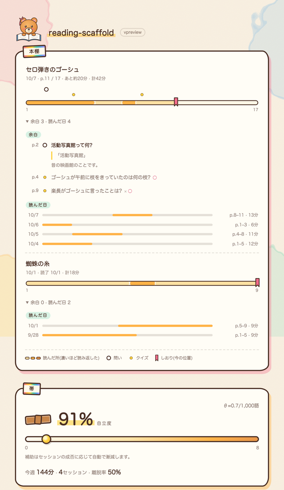
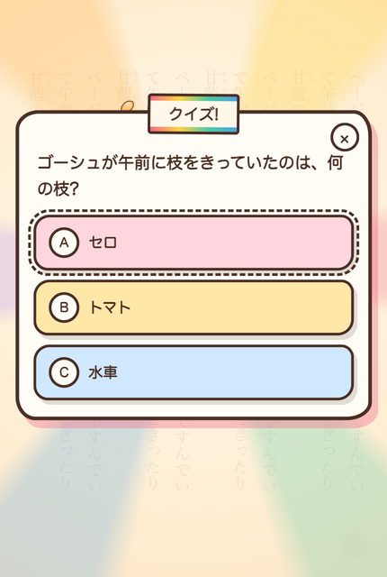
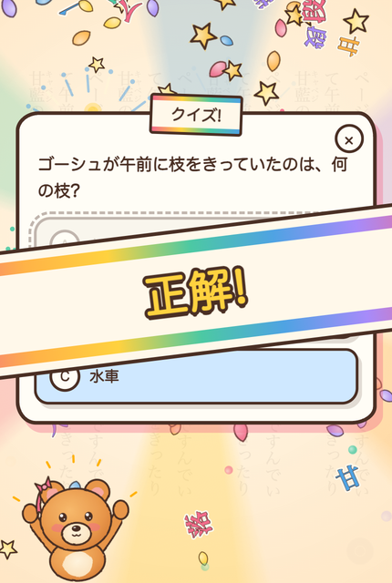
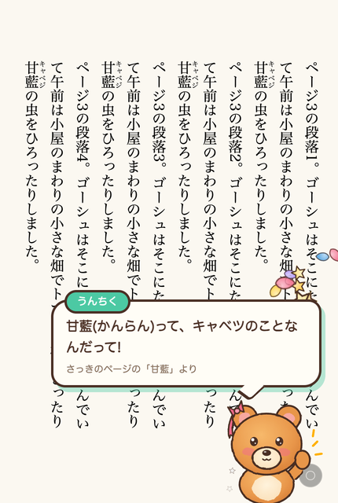
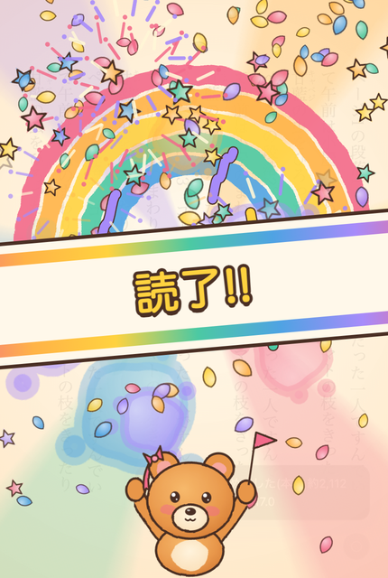

# 見た目と言葉のテイスト(スタイルガイド)

- **Status:** 2026-10-08。読書中の演出(stage.js・margin.js・paint.js・bear.js)とダッシュボードが、このテイストの見本
- **使い方:** 画面・演出・画像を新しく作るとき、直すときは、ここに合わせる。迷ったら §1 の見本の画像と、§10 のチェックリストを見る
- **値の出どころ:** 色と線は `extension/src/dashboard/dashboard.css` の `:root`(popup と onboarding は同じ値を `extension/src/shared/paper.css` から読む)、水彩の6色と星の色は `extension/src/content/paint.js`、カードと帯は `extension/src/content/stage.js` の CSS、くまは `extension/src/content/bear.js`

---

## 0. ひとことで

**絵本・水彩。** 生成りの紙に水彩のにじみ、セピアの太い描き線、丸ゴシック。どこか手描きで、少しだけゆがんで傾いている。案内役はくま。

- 報酬は**雰囲気**(光・花びら・動き)で伝え、言葉は少なく
- 派手さは θ に比例する。θ が高いほど祭り、低いほど静か、θ=0 では何も出さない
- 読書中は**本文の外**にだけ描く。読んでいる文字の上には重ねない(大きく覆うのは突然クイズと読了の瞬間だけ)
- 記録の画面(ダッシュボード)は落ち着いた紙のカード。動きは入場だけで、ご褒美の演出は出さない

## 1. 見本

| ダッシュボード(記録) | 突然クイズ | 正解 | くまのうんちく | 読了 |
|---|---|---|---|---|
|  |  |  |  |  |

(うんちくの画像の右下にある灰色の丸は、まだ旧テーマのままの問いのボタン。§9)

## 2. 色

紙とインクと、水彩の6色だけを使う。純粋な黒・白・灰は使わない。

| 名前 | 値 | 使いどころ |
|---|---|---|
| paper | `#fffdf6` | カード・吹き出し・ボタンの地 |
| bg | `#fbf3e4` | 画面の地(紙のざらつきを重ねる) |
| ink | `#4a2f24` | 線・文字(セピア)。薄い文字は `rgba(74,47,36,.62)`、罫線は `.14` |
| coral | `#f26b8a` | 水彩の6色。しおり・リボン・誤り以外の差し色 |
| honey | `#ffb347` | 同上。帯・読んだ区間 |
| sun | `#ffd23f` | 同上。蛍光ペン・帯の文字 |
| mint | `#4cc9a3` | 同上。小見出しの丸ラベル・うんちくのタグ |
| sky | `#4fa3e3` | 同上 |
| lilac | `#a78bfa` | 同上 |
| honey-deep / coral-deep | `#e8964a` / `#d9486b` | 紙の上で読ませたい線や文字。coral-deep は危ない操作(全消去) |
| rainbow | 6色を左→右の順に並べたグラデーション | 本の帯ラベルの上下の線、読了の帯 |

- **色の語彙(星):** 銀 `#eef1f6 #d5dbe6 #c3cad8`=いつも / 金 `#ffd23f #ffc23a #ffe17a`=レア / 虹=6色=激レア。金と虹は「大きいものが来る」合図なので、ふつうの飾りに使わない
- クイズの選択肢は、薄めた水彩の3色 `#ffd6de` `#ffe7a8` `#cfe8ff`。選べなくなったものは `#ece6dd` に文字 `#a4968a`
- 影はぼかさず、**色付きのずらし影**(§4)。カードごとに6色を順に回す
- 赤で警告しない。危ない操作だけ coral-deep の線と文字にする

## 3. 文字

- **丸ゴシック:** `'Hiragino Maru Gothic ProN', 'Zen Maru Gothic', 'M PLUS Rounded 1c', 'Hiragino Sans', sans-serif`
- 本文 14px・行間 1.7。見出しやラベルは太く(800〜900)、少し字間を空ける(`letter-spacing: .08em` 前後)
- 数字は `font-variant-numeric: tabular-nums`
- 強調は**水彩の蛍光ペン**: 文字の下 4 割に黄色を引く `linear-gradient(transparent 60%, rgba(255,210,63,.6) 60%, rgba(255,210,63,.6) 90%, transparent 90%)`
- 大きな言葉(「正解!」「読了!!」)は sun の文字に ink の太い縁取り: `-webkit-text-stroke: 7px var(--ink); paint-order: stroke fill; text-shadow: 0 5px 0 var(--ink)`
- ことば吹雪(本の字が舞う)だけは明朝: `'Hiragino Mincho ProN', 'Yu Mincho', 'Noto Serif JP', serif`。紙色の縁 5px+ink の縁 1.6px

## 4. 線と形

- **線は太いセピア:** `3px solid #4a2f24`(カード・帯・ボタンは 2.5〜4px)。端と角は丸く
- **手描きの角丸:** 四隅をそろえない。例 `border-radius: 24px 18px 26px 20px / 20px 26px 18px 24px`。隣どうしのカードで値を入れ替えて、同じ形を並べない
- **色付きのずらし影:** `box-shadow: 6px 8px 0 rgba(242,107,138,.34)`(カード)、`3px 4px 0 …`(ボタン)。ぼかしなし。色は6色を順に、透明度 .3〜.5
- **本の帯ラベル(見出し):** 生成りの小さな札 `#fff8ea` に ink の線、上下に虹の線(4〜5px)。カードの上辺にかけ、`rotate(±2〜3deg)` で少し傾ける
- **丸ラベル(小見出し):** `border-radius: 999px`、mint を薄めた地 `rgba(76,201,163,.22)`、11px・900・字間 .14em
- **ボタン:** 丸い錠剤形(`999px`)、2.5px の線、paper の地、色付きのずらし影。hover で `translate(-1px,-1px)`、押すと影の位置まで沈む(`translate(3px,4px)`・影なし)
- 傾け・ゆがみは小さく(±2〜4度)。全部を傾けない。札・帯・くまのような「置かれたもの」だけ

## 5. 質感

- **紙のざらつき:** 地に `feTurbulence`(fractalNoise・baseFrequency .85)の薄いノイズ(不透明度 .07 程度)を敷く
- **四隅の水彩のにじみ:** 画面の四隅に coral・sky・mint・sun の大きな丸を、`feDisplacementMap`(scale 70)でにじませ、不透明度 .12〜.2 で置く。縁は少し濃く(水彩の溜まり)
- **水彩の塗り(paint.js の `wash`):** 地の色を不透明度 .86 で塗り → 左上に白の放射グラデーション(.55→0)で明るいムラ → 同じ色で縁を細く(線幅=半径×.16・不透明度 .5)。形はスプライトに一度だけ焼いて使い回す
- **手描きの線のゆれ(bear.js):** 塗りは `feDisplacementMap` scale 7 でにじませ、線は scale 2.2 で少しだけ揺らす(`feTurbulence` baseFrequency .035 / .06)。SVG のフィルタの id は描くたびに変える(同じ層に複数あっても衝突しない)
- 写真・リアルな陰影・ガラス風・グラデーションのボタンは使わない

## 6. くま

- 茶色の毛 `#f7b96b → #e8964a → #d77f37` の放射グラデーション、お腹とマズルはクリーム `#fff3dc → #fbe2bd`、耳の内側 `#f7a8a0`、ほっぺ薄いピンク。線は ink 4.2px・丸い端
- 顔は「ちょっと抜けた」点目と小さな ω の口。耳にしおりのリボン(coral)
- ポーズは3つ: **peek**(開いた本から顔を出す・ふだん)/ **talk**(手を挙げて話す・うんちく)/ **cheer**(バンザイ・正解と読了。読了は旗つき)
- くまは**演出**であってペットではない。育たない・お腹が空かない・要求しない・θ=0 で出なくなる。新しいキャラクターは増やさない
- 出し方は画面の下の隅からひょこっと(読書は止めない)、または大きな瞬間の画面の下で跳ねる

## 7. 動き

- **ぽんと置く:** 弾むイージング `cubic-bezier(.2, 1.4〜1.6, .4, 1)`、0.45〜0.6秒。出てくるものは小さく・少し回って・ふくらんでから落ち着く
- **入場(記録の画面):** 下から 14px・0.98倍から、0.55秒。要素ごとに 0.06秒ずつずらす。入場のほかは動かさない
- **読書中のふだん:** 余白で花が咲いて花びらが流れる・星がふっと瞬く。小さく、短く、本文の外だけ
- **大きな瞬間(突然クイズ・読了):** 画面全体に紙のベール、回る光の筋、花火・花びら・ことば吹雪、本の帯が横から滑り込む。正解は「おしい!」で選び直せる(揺れて薄くなるだけ。責めない)
- 量と速さは θ に比例(intensity 0.15〜1)。θ が低いほど少なく静かに
- **動きを減らす設定**(`prefers-reduced-motion: reduce`)では、アニメーションをほぼ止め、舞う部品を数個にする
- 舞うものが無いときは描画を止める(電池を食わない)

## 8. 画面ごとの使い分け(三分法と対応)

| | 演出(読書中) | 記録(ダッシュボード) | 道具(問い) |
|---|---|---|---|
| 気分 | 祭り〜静か(θ次第) | 落ち着いた紙の本棚 | 静かな文房具 |
| 動き | 弾む・舞う・瞬く | 入場だけ | 開閉だけ |
| ご褒美 | あり(乱数・レア度) | なし | なし(回答に演出をつけない) |
| 場所 | 本文の外の余白・画面の下の隅・大きな瞬間だけ全体 | ページ全体 | 本文フレームの右下の小さなボタン |

## 9. 言葉のトーン

- **事実だけ:** 進捗・経過分・ページ。褒め(「いい調子」)・労い(「おつかれさま」)・教訓・アドバイスは書かない
- ご褒美の言葉はピークの瞬間だけ: 「正解!」「大当たり!!」「読了!!」「おしい!」
- **くまの口調:** やさしく短く、1〜2文・60字以内。「〜なんだって!」「〜らしいよ」。出どころを小さく添える(「さっきのページの『甘藍』より」)
- 説明文は「です・ます」で短く。ラベルは名詞で止める(「本棚」「余白」「読んだ日」)
- 責めない: 赤い警告・未達の催促・減点・連続記録・残り時間の示唆を出さない
- 絵文字は使わない(絵はくまと水彩が担う)
- 補助の量(θ)の数字は読書中の画面に出さない

## 10. チェックリスト

作ったものを見て、全部「はい」になるか。

- [ ] 色は紙・ink・水彩の6色(とその薄め)だけか。灰色や純白・純黒が混ざっていないか
- [ ] 線はセピアの太い線か。角丸は四隅で少しずつ違うか
- [ ] 影はぼかしなしの色付きのずらし影か
- [ ] 字は丸ゴシックか。強調は蛍光ペンか
- [ ] 金・虹を、レアの合図以外に使っていないか
- [ ] 読書中なら、本文の文字の上に何も重ねていないか
- [ ] 量と派手さは θ に比例し、θ=0 で消えるか
- [ ] 記録の画面に、ご褒美の動きや乱数を入れていないか
- [ ] 言葉で褒めていないか・教えていないか(例外は §9 の言葉だけ)
- [ ] 動きを減らす設定で止まるか

## 11. まだそろっていない所

次の画面は旧テーマ(「夜の書斎」の金と黒、`system-ui` の字)のまま。触るときはこのガイドに寄せる。

- **overlay.js** の問いのボタン・通知・回答カード(読書中、本文フレームの右下)

popup と onboarding は 2026-10-08 にこのテイストに寄せた(`shared/paper.css` が土台。紙・札・ボタン・カードはそこにあり、各画面の CSS は配置だけ)。

## 12. ドキュメントの図

製品の画面とは別のテイスト。説明のための図は、すっきり・事務的に描く(見本: [overview.svg](overview.svg))。

- 字は `'Hiragino Sans','Hiragino Kaku Gothic ProN','Noto Sans JP'`。白地、角丸 6〜10px の箱
- 箱の色で状態を表す: できている=緑 `#e1f5ee`/`#0f6e56`、動くが残りがある=黄 `#fdf3d7`/`#b7791f`、サードパーティ=青灰 `#e8edf4`/`#5b6b7f`
- 線の色で意味を表す: 中核の流れ=紫 `#534ab7`(太く・番号 ①〜)、呼び出し=濃い灰 `#3d3d3a`、利用者の操作=薄い灰 `#a3a29d`、端末の外へ出る=橙 `#c2410c`
- 線のラベルは白い札に載せる。右上に凡例を置く
- Mermaid の図も同じ配色に寄せる(緑=端末内、橙の点線=外へ出る)
