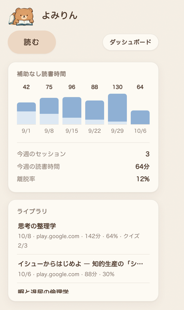
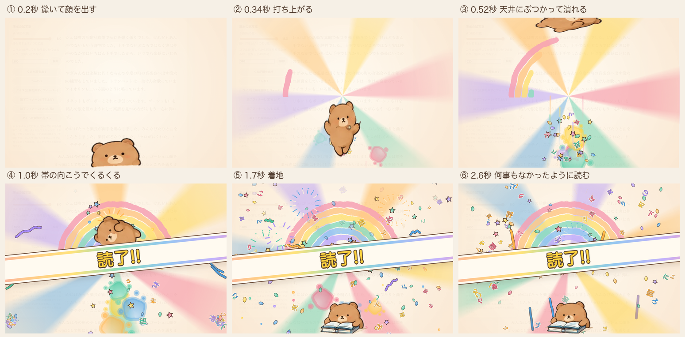
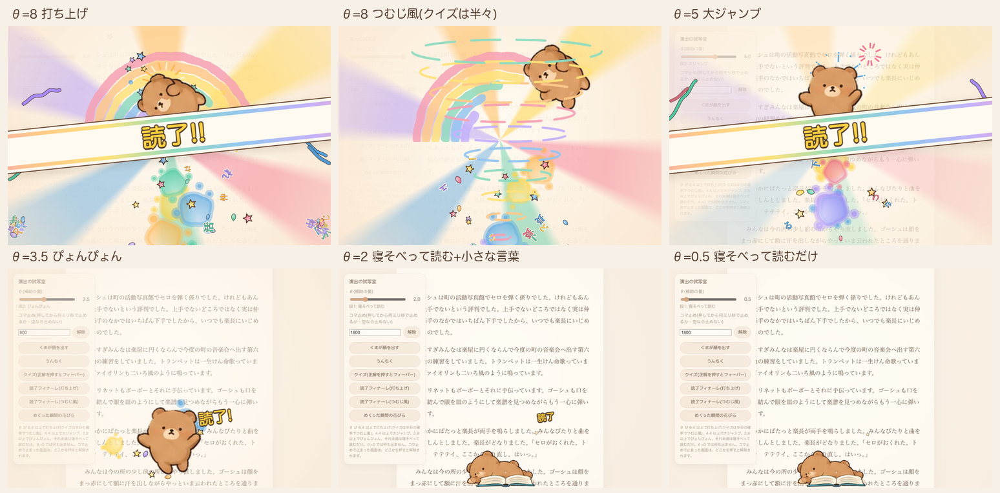

# 見た目と言葉のテイスト(スタイルガイド)

- **Status:** 2026-10-09。「静」と「動」の二つの調子に切り替えた(それまでは全部が絵本・水彩の太い線と6色だった)
- **使い方:** 画面・演出・画像を新しく作るとき、直すときは、ここに合わせる。迷ったら §1 の見本と、§10 のチェックリストを見る
- **値の出どころ:** 静の色と形は `extension/src/shared/paper.css` の `:root`(ダッシュボードは `extension/src/dashboard/dashboard.css` の `:root` に同じ値)。動はカード・帯・台本が `extension/src/content/stage.js`、水彩の6色と星の色が `extension/src/content/paint.js`。くまは `extension/assets/bear/`(§6)
- **動きを見る:** リポジトリの一番上で `python3 -m http.server 8000` → http://localhost:8000/tools/preview/(θ・出し方・コマ止めを変えて見られる)

---

## 0. ひとことで

**静かな紙と、思いきり派手なフィーバー。** ふだん(ダッシュボード・popup・初回の案内・読書中の隅のくま)は、生成りの紙に細い線と柔らかい影の、落ち着いた画面。クイズの正解と読了の瞬間だけ、くまが打ち上がって天井にぶつかり、虹と光と紙吹雪が画面を覆う。案内役はくま(色鉛筆と水彩のポーズ集の絵)。

- **対比が報酬になる。** ふだんを静かにしておくほど、フィーバーが効く(予測誤差は地との差で決まる)。だから記録の画面には、金・虹・はずむ動きを持ち込まない
- 派手さは θ に比例する。θ が高いほど祭り、低いほど静か、θ=0 では何も出さない
- 読書中は**本文の外**にだけ描く。読んでいる文字の上には重ねない(大きく覆うのは突然クイズ・章の終わり・読了の瞬間だけ)
- 言葉は少なく。報酬は雰囲気(光・動き)で伝える。擬音も出さない

### 読書中の原則(2026-10-09)

1. **派手さは「動きの速さ」ではなく「色・量・広さ」で出す。** 視界の端で何かが動き出すと、目は反射的に引っぱられる。色がゆっくり変わる・広く淡く光る・数が増える、は目を奪わない
2. **派手にする瞬間は「目が文章から離れる瞬間」に寄せる。** めくり中・章の終わり。読書の空白時間に報酬を押し込む。新しいページを読み始める頃には、動きは終わっている
3. **読んでいる瞬間には動かさない。読んでいる時間の報酬は「世界が育っていること」で表す。** 余白は静止したまま豊かになっていく
4. **手が止まっても何も減らさない。** 考えて止まる時間も読書。「色が薄くなっちゃう」と思わせた瞬間、続けろメーター(ストリーク)になる。ページを速く進める人ではなく、本に注意を留められる人を育てる
5. **予告で「あと何ページ」を示さない。** 周辺視野で「なんか世界が変わってきた」くらいにとどめ、意識は本に置いたままにする

### 報酬の3つの階層

| 階層 | いつ | 何 | θ が下がると |
|---|---|---|---|
| Micro | めくり中(抽選) | めくりの光: 画面の上下の縁を細い虹が走り、0.6秒で消える | 頻度が下がる |
| Meso | 読書中(静止) | よみりんの小さなストーリー: 画面の右下の角で、無言のくまが一つのものを作り進める(本を積む・パンケーキを重ねる…)。最初のめくりで1コマ目が現れ、そのあとはめくるたびに確率で1コマ進み、最後から2つ目のコマで待つ。縁の色がめくるたびに少しずつ育つ。予告(金の星 → くまの耳 → 虹のかけら)は話の近くに | 進みが遅く、小さくなる |
| Macro | 章の終わり・読了 | ここだけ狂う: 話がオチる(弾ける・崩れる・飛んでいく・仕上がる・寝たまま…)→ 余白が真ん中へ吸い込まれ → 光と虹と紙吹雪 → くまが打ち上がる → 「章 読了!!」/「読了!!」→ 数秒で「スン…」と本に戻る | 狂い方が小さくなる |

θ が下がるにつれ、Macro の狂い方 → Meso の進み方と大きさ → Micro の頻度、と世界そのものが静かになる。

### よみりんの小さなストーリー(2026-10-10)

- **蓄積を一つのオブジェクトに集める。** 飾りを散らしても「溜まった感」は出ない(脳には別々の飾りに見える)。数を増やすより、一つのものの状態を大きく変える。溜まったもの(テンション)と解放を同じオブジェクトでつなぐ: 膨らんでいく → 限界で待つ → 章の終わりにオチ
- **無言のくまが、画面の端で裏の謎のストーリーを進めている。** 何を作っているのか・あと何コマかは一切説明しない。「何作ってんだこいつ?」「次にめくったら何が変わってるんだろ」
- **毎回は進めない。** 何もない → 何もない → 1コマ → 何もない → 2コマ…。話によって長さも違う。進捗バーにしない。「あのクマが勝手に生活してる」
- **全部を派手な成功にしない。** 崩れる(パンケーキ)・飛んでいく(風船)・寝たまま(寝床 — 章のフィーバーの横で寝ている)。オチが予測できないことが「次は何してるんだろ」になる
- **持ち越さない。** 章ごとに新しい話。完成した話の一覧も作らない(収集・在庫は移植しない)。くまはペットではない(育たない・要求しない)
- 絵はストーリー集の絵(`style/ref/story-sheet-1.png`・18話×4〜6コマ)から切り抜いたもの: `python3 -I tools/story-sprites/cut.py docs/style/ref/story-sheet-1.png --sheet 確認.png`(コマの区切りは cut.py の `STORIES`)。話とオチの表は `extension/src/content/stories.js`、動きは `story.js`

## 1. 見本

| 静: ダッシュボード | 静: popup | 突然クイズ | くまのうんちく |
|---|---|---|---|
|  |  |  |  |

**動: 読了フィナーレ(θ=8・打ち上げ)**

**動: θ による違い**

くまの絵の元: [style/ref/pose-sheet.png](style/ref/pose-sheet.png)(ポーズ集)・[style/ref/icon-sheet.png](style/ref/icon-sheet.png)(アイコン。16/32px は小さい用に描き分けた絵を使う)

## 2. 色

### 静(記録・道具・ふだん)

紙とインクと、くすんだ差し色だけ。純粋な黒・白・灰、鮮やかな色は使わない。

| 名前 | 値 | 使いどころ |
|---|---|---|
| bg | `#f6f0e6` | 画面の地 |
| paper | `#fdfaf3` | カード |
| ink | `#4f3a2c` | 文字。薄い文字は `--muted`(`rgba(79,58,44,.68)`・紙の上で 4.5:1)、罫線は `--faint`(`.10`) |
| caramel | `#c58a5c`(淡い `#ecd7c3`・文字用の濃い `#94623f`) | 主の差し色(くまの毛の色)。主のボタン・読んだ区間・θ の線 |
| sage | `#94a888`(淡い `#e3eadb`・文字用 `#55694a`) | 小見出しの丸ラベル・問いの印 |
| dusty | `#8fb0d4`(淡い `#dde8f3`) | 棒グラフ・スライダー・チェックボックス・クイズの印 |
| blush | `#e3a596` | しおり |
| danger | `#b5523b` | 危ない操作(全消去)の線と文字だけ。赤い面では警告しない |
| focus | `#6b8fba` | フォーカスの輪郭 |

- 帯(段位)もくすんだ色: 白 `#fbf6ec`・黄 `#e9d08f`・緑 `#a9bf9c`・茶 `#b98257`・黒 `#4f3a2c`(`dashboard.js` の `rankFor`)

### 動(読書中の演出)

- **水彩の6色**(`paint.js`): coral `#f26b8a`・honey `#ffb347`・sun `#ffd23f`・mint `#4cc9a3`・sky `#4fa3e3`・lilac `#a78bfa`。花びら・しぶき・花火・リボン
- **パステルの6色**(`stage.js` の `PASTEL`): `#f7a1b4 #ffc98a #ffe27a #8fdcc0 #94c6f0 #c4b2fb`。虹・光の筋・帯の上下の線・効果線・つむじ風
- **色の語彙(星):** 銀 `#eef1f6 #d5dbe6 #c3cad8`=いつも / 金 `#ffd23f #ffc23a #ffe17a`=レア / 虹=6色=激レア。金と虹は「大きいものが来る」合図なので、ふつうの飾りに使わない(静の画面には出さない)
- 線は茶 `#6b4b37`(カード・帯・吹き出し)。クイズの選択肢は淡い `#ffe3e6` `#fff0c9` `#e1eefb`、選べなくなったものは `#efe9e1` に文字 `#a4968a`

## 3. 文字

- **丸ゴシック:** `'Hiragino Maru Gothic ProN', 'Zen Maru Gothic', 'M PLUS Rounded 1c', 'Hiragino Sans', sans-serif`
- **静:** 本文 14px・行間 1.7・太さ 400〜500。見出し 600〜700。900 は使わない。節の名前は小さな薄い文字(12.5px・600)。大きな数字は 34px・600。数字は `tabular-nums`。強調は文字の下に淡いキャラメルを引く
- **動:** 大きな言葉(「読了!!」「大当たり!!」「正解!」)は sun の文字に ink の太い縁取り: `-webkit-text-stroke: 7px; paint-order: stroke fill; text-shadow: 0 5px 0`。段2・1の小さな言葉も同じ形で小さく(縁 6px)
- ことば吹雪(本の字が舞う)だけは明朝: `'Hiragino Mincho ProN', 'Yu Mincho', 'Noto Serif JP', serif`

## 4. 線と形

### 静

- 線は無しか `1px solid var(--faint)`。太い線で囲まない
- 角丸はそろえる: カード 16px・中の部品 12px・ボタンと丸ラベル 999px
- 影はぼかした柔らかいものだけ: `0 1px 2px rgba(79,58,44,.05), 0 6px 18px rgba(79,58,44,.06)`。色付きのずらし影は使わない
- 傾けない。節の名前は帯にせず、カードの中の小さな文字にする
- ボタンは柔らかい錠剤形。主の操作だけ淡いキャラメルの地、ほかは紙の地。ホバーは地が少し濃くなるだけ(跳ねない・沈まない)

### 動

- クイズのカード・吹き出しは、紙の地に茶の線 2〜2.5px・角丸 22〜26px・ぼかした影。くまの絵(細い色鉛筆の線)に合わせて、線は太くしすぎない
- **本の帯(大):** 生成りの帯に茶の線 3px、内側の上下にパステルの虹の線 12px。`rotate(-6deg)` で横から滑り込む
- **光の筋:** パステルの円錐グラデーションを、中心から開いて(バーン)回す。縁はぼかしでなく色の移り変わりで柔らかくする(重いので)

## 5. 質感

- **静:** 地は平らな bg に、ごく薄い紙のノイズ(不透明度 .03)だけ。四隅のにじみや水彩の塗りは置かない
- **動:** 水彩の塗り(`paint.js` の `wash`)— 地の色を不透明度 .86 で塗り、左上に白の放射グラデーションで明るいムラ、縁を同じ色で細く。形はスプライトに一度だけ焼いて使い回す。虹は `feDisplacementMap` で少しにじませる
- 写真・リアルな陰影・ガラス風・グラデーションのボタンは使わない

## 6. くま

- **絵はポーズ集から切り抜いた画像**(`extension/assets/bear/<ポーズ>.webp`)。コードで描き直さない。切り抜きは `python3 -I tools/bear-sprites/cut.py docs/style/ref/pose-sheet.png`(ポーズの名前と箱は `cut.py` の `POSES`)
- 色鉛筆と水彩のタッチ、点の目と小さな口、丸い体。表情は控えめ
- ポーズの一覧は `bear.js` の冒頭(ふだん・顔だけ・リアクション・フィーバー・小物・シルエット)
- **どこに何を出すか(はじめは全部盛り。使いながら取捨選択する):**

| 場所 | くま |
|---|---|
| ダッシュボードのヘッダ | θ で居場所が変わる: 隣で一緒に読む `read` → 自分の本 `read-side` → 背を向ける `turn` → 卒業(θ=0)したら本だけ `book`。状態を示すだけで、動きもご褒美もない |
| 本棚・popup に記録がまだ無い | 箱に入る `box` |
| popup | はじめ `front` / ふだん `read` / 計測中 `focus` / 終えた直後(主張のカード)`sleep-book` |
| 初回の案内 | はじめ `front` / 診断 `think-read` / 目標 `what` / おわり `read` |
| 隅で顔を出す(ふつう) | 下の縁から: 顔だけ `head`(まばたき2回)・`read` `chin` `turn-page` `focus` `chira`。左右の縁から: `nozoku`、`hyo` → `ear`(耳ぴこ)。右の縁は鏡写し |
| 隅で顔を出す(レア・金の星) | `mug` `box` `stack` |
| 隅で顔を出す(激レア・虹の星) | `tower`(積読の上) |
| うんちく | 言葉の意味・読みの話は `what`(なにそれ?)、物事の豆知識は `idea`(ひらめき・電球) |
| よみりんの話 | 画面の右下の角で、ストーリー集のコマ(`extension/assets/story/<話>-<コマ>.webp`)が、めくるたびに確率で入れ替わる(静止)。話がある間、隅のくまは左から出る |
| 余白で一緒に読む | (止めてある)章ごとに一度、5回目のめくりで `read` が余白の下に座る(静止) |
| 激レアの予告 | `nyo`(にょっ)が画面の下の縁から耳だけ出す(静止) |
| 余白の飾り | (ふだんの飾りは止めてある)ポーズ集のエフェクト素材 `fx-leaf` `fx-tulip` `fx-flower` `fx-orange` `fx-sprig` `fx-blossom` `fx-petals`(ふだん)、`fx-star`(金の星・予告)、`fx-sparkles`(金のきらきら・レアの当たり)。花と銀の星と虹のかけらは `paint.js` で描く |
| 激レアの当たり | `launch` が画面を斜めに駆け抜ける |
| フィーバー | `wait` → `surprise` → `jump` → `launch` → `tumble`(大当たりは `spin` で虹に乗る)→ `fall` → `land` → 読了は `flag` を振る / 正解は `back` |

- 大きさは絵の元の大きさ×一定の倍率で決める(どのポーズでもくまの大きさがそろう)。隅は 0.42〜0.62 倍(画面が小さいほど小さく)
- **入れない使い方:** 眠い・疲れた・しょぼん・よろ…を、読むのをやめたときや間違えたときの反応にしない(責める・構ってほしがるに見える)。間違えたときにくまで反応しない(「おしい!」で十分)。問いの答えにくまを出さない(回答に演出をつけない)。クイズの待ち時間に「じー…」を出さない(急かす)
- くまは**演出**であってペットではない。育たない・お腹が空かない・要求しない・θ=0 で出なくなる。新しいキャラクターは増やさない
- 1体ずつの高解像度の絵(背景が透明・同じ名前)が来たら、`extension/assets/bear/` を差し替えるだけでよい。体を曲げる動き(瞬き・腕を振る)が欲しくなったら、くまだけ部品に分けて Rive などに移す(舞台と粒はそのまま)

## 7. 動き

- **静(記録の画面):** 入場だけ。下から 6px・0.4秒・ease-out で、要素ごとに少しずらす。そのほかは動かさない
- **読書中の派手さ(Micro・Meso・Macro):** §0 の原則と表のとおり。動くのはめくり中と章の終わり・読了だけで、よみりんの話のコマはめくった瞬間にふわっと(0.9秒)入れ替わり、余白の印は(1.4秒)現れて、あとは動かない。話のオチは章の終わりに 0.7〜1.6 秒(最後のコマに 0.3 秒で替えてから、弾ける・崩れる・飛ぶ・滑る・光る・跳ねる)。寝たままの話(寝床・クッキー・毛糸)は、フィーバーをくま抜きで出し、端の絵を幕の上に残す。縁の色の変化もめくった瞬間に始まり、4秒かけてゆっくり。章の終わりは、余白の飾りが0.4秒で真ん中へ吸い込まれてからフィーバーへ。激レアの当たりは、くまが画面を斜めに駆け抜ける(0.7秒・幕なし)。値は config の `READING_FX`、見た目は `margin.js`
- **隅のくま(読書中のふだん):** 画面の下の隅からぽんと出て(`cubic-bezier(.2,1.5,.4,1)`・0.55秒)、少し揺れて引っ込む。左右の縁からは横に滑り込んで戻る。まばたき・耳ぴこは絵の差し替え。花びらと星を少し(銀・レアは金・激レアは虹)。小さく、短く、本文の外だけ
- **フィーバー(正解・読了):** `stage.js` の `fever()` の台本(時刻ごとの位置・伸び縮み・回転・絵の差し替え・効果)で動かす。数字を変えれば動きが変わる
  - 段4(θ ≥ 6.4)打ち上げ: 0.15秒 驚いて顔を出す → 0.22秒 光の筋と虹 → 0.3秒 打ち上がる(縦に伸びる・効果線)→ 0.5秒 天井にぶつかる(横に潰れる・画面が揺れる)→ 0.65秒 本の帯 → 0.9秒 紙吹雪 → 1.2秒 落ちてくる → 1.5秒 着地(潰れて戻る)→ 何事もなかったように本を開く。クイズは半々で**つむじ風**(竜巻に巻かれてぐるぐる昇り、画面の外へ → 上から落ちてくる)
  - 段3(θ ≥ 4.4)大ジャンプで一回転・本の帯 / 段2(θ ≥ 2.8)ぴょんぴょん・小さな言葉 / 段1 寝そべって読むだけ
  - 着地まで 0.7〜1.9 秒。くまは帯の奥を通る(帯の言葉を隠さない)
  - 伸び縮みは潰れる辺を止めて潰す(天井は上の辺、着地は下の辺)
- **動きを減らす設定**(`prefers-reduced-motion: reduce`)では、フィーバーは動かさず本を開いたくまと帯を置くだけ。舞う部品は数個にする
- 舞うものが無いときは描画を止める(電池を食わない)

## 8. 画面ごとの使い分け(三分法と対応)

| | 演出(読書中) | 記録(ダッシュボード・popup) | 道具(問い) |
|---|---|---|---|
| 気分 | 隅は静か、正解と読了だけ祭り(θ次第) | 静かな紙 | 静かな文房具 |
| 動き | 弾む・飛ぶ・潰れる・舞う | 入場だけ | 開閉だけ |
| ご褒美 | あり(乱数・レア度) | なし | なし(回答に演出をつけない) |
| 色 | 水彩・パステル・金・虹 | くすんだ差し色だけ | くすんだ差し色だけ |
| 場所 | 本文の外の余白・画面の下の隅・大きな瞬間だけ全体 | ページ全体 | 本文フレームの右下の小さなボタン |

## 9. 言葉のトーン

- **事実だけ:** 進捗・経過分・ページ。褒め(「いい調子」「よく読めてるね」)・労い(「おつかれさま」)・教訓・アドバイスは書かない。参考画像に入っていた吹き出しの言葉も同じ扱い
- ご褒美の言葉はピークの瞬間だけ: 「正解!」「大当たり!!」「読了!!」「おしい!」
- 擬音(ぎゅいーん・べちっ・すとん・♪ など)は出さない。動きと絵だけで伝える(2026-10-09)
- **くまの口調:** やさしく短く、1〜2文・60字以内。「〜なんだって!」「〜らしいよ」。出どころを小さく添える(「さっきのページの『甘藍』より」)
- 説明文は「です・ます」で短く。ラベルは名詞で止める(「本棚」「余白」「読んだ日」)
- 責めない: 赤い警告・未達の催促・減点・連続記録・残り時間の示唆を出さない
- 絵文字は使わない(絵はくまと水彩が担う)
- 補助の量(θ)の数字は読書中の画面に出さない

## 10. チェックリスト

作ったものを見て、全部「はい」になるか。

- [ ] 静の画面なら: 色は紙・ink・くすんだ差し色だけか。金・虹・鮮やかな6色が混ざっていないか
- [ ] 静の画面なら: 線は細いか無いか。影はぼかした柔らかいものか。傾けていないか。動きは入場だけか
- [ ] 動なら: 金・虹をレアの合図と大きな瞬間以外に使っていないか
- [ ] 字は丸ゴシックか(ことば吹雪だけ明朝)
- [ ] くまはポーズ集の絵か(コードで描いていないか・新しいキャラクターを足していないか)
- [ ] 読書中なら、本文の文字の上に何も重ねていないか(正解と読了の瞬間を除く)
- [ ] 量と派手さは θ に比例し、θ=0 で消えるか
- [ ] 記録の画面に、ご褒美の動きや乱数を入れていないか
- [ ] 言葉で褒めていないか・教えていないか・擬音を足していないか(例外は §9 のピークの言葉だけ)
- [ ] 動きを減らす設定で止まるか

## 11. まだそろっていない所

- **overlay.js** の問いのボタン・通知・回答カード(読書中、本文フレームの右下)は旧テーマ(「夜の書斎」の金と黒、`system-ui` の字)のまま。触るときは静に寄せる
- **よみりんの小さなストーリー**(2026-10-10)は試写室でしか見ていない。本物の Play ブックスで、置き場所(右の余白の帯が本文に数えられていないか)・進み方の速さ・章の区切りで当たるかを確かめる。コマの絵は1536×1024 の1枚から切り抜いて2倍にしたもので、少しぼやける(1コマずつの高解像度の絵が来たら、同じ名前で差し替えるだけでよい)。新しい絵が要る話(ロケット・秘密基地・ピクニック…)はストーリー集 ② で
- **読書中の派手さ(Micro・Meso・Macro)** は 2026-10-09 に作ったばかり。試写室でしか見ていない。章の始まりの見つけ方(見出しか、本文より字が大きい短い行)が Play ブックスの本で当たるかは、本物で確かめる
- **くまの絵の解像度:** いまはポーズ集(1536×1024 の1枚)から切り抜いて2倍に引き伸ばしたもの。大きく出すフィーバーでは少しぼやける。1体ずつの高解像度の絵に差し替えたい(§6)
- **ストアのプロモーション タイルとスクリーンショット**は、旧テーマのものを消したので作り直す(`docs/store/tools/README.md`)。アイコンは 2026-10-09 に新しいくまにした(`tools/bear-sprites/icons.py`・元絵は `style/ref/icon-sheet.png`)

## 12. ドキュメントの図

製品の画面とは別のテイスト。説明のための図は、すっきり・事務的に描く(見本: [overview.svg](overview.svg))。

- 字は `'Hiragino Sans','Hiragino Kaku Gothic ProN','Noto Sans JP'`。白地、角丸 6〜10px の箱
- 箱の色で状態を表す: できている=緑 `#e1f5ee`/`#0f6e56`、動くが残りがある=黄 `#fdf3d7`/`#b7791f`、サードパーティ=青灰 `#e8edf4`/`#5b6b7f`
- 線の色で意味を表す: 中核の流れ=紫 `#534ab7`(太く・番号 ①〜)、呼び出し=濃い灰 `#3d3d3a`、利用者の操作=薄い灰 `#a3a29d`、端末の外へ出る=橙 `#c2410c`
- 線のラベルは白い札に載せる。右上に凡例を置く
- Mermaid の図も同じ配色に寄せる(緑=端末内、橙の点線=外へ出る)
